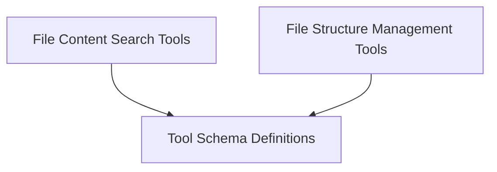

# `crewai_tools_data_file_tools` Module Documentation

## Introduction

The `crewai_tools_data_file_tools` module provides a comprehensive suite of tools designed for interacting with and manipulating various data files and directories. It offers functionalities for searching content within different file formats (CSV, DOCX, JSON, MDX, PDF, TXT, XML), reading directory structures, writing data to files, and compressing files or directories. This module is essential for agents that need to process and manage local or remote file-based information.

## Architecture Overview

The module is structured into three main sub-modules, each focusing on a distinct aspect of file interaction:

*   **File Content Search Tools**: Dedicated to searching and retrieving information from various file types.
*   **File Structure Management Tools**: Handles operations related to file and directory structures, such as reading, writing, and compression.
*   **Tool Schema Definitions**: Contains the input schemas for all tools, ensuring proper validation and argument structuring.

<!-- DIAGRAM_JSON
{
    "direction": "TD",
    "nodes": [
        {"id": "file_content_search_tools", "label": "File Content Search Tools", "type": "module", "link": "file_content_search_tools.md"},
        {"id": "file_structure_tools", "label": "File Structure Management Tools", "type": "module", "link": "file_structure_tools.md"},
        {"id": "schema_definitions", "label": "Tool Schema Definitions", "type": "module", "link": "schema_definitions.md"}
    ],
    "edges": [
        {"source": "file_content_search_tools", "target": "schema_definitions"},
        {"source": "file_structure_tools", "target": "schema_definitions"}
    ],
    "groups": []
}
-->

## Sub-modules

### [File Content Search Tools](file_content_search_tools.md)
This sub-module provides a suite of tools for semantic searching within various file types such as CSV, DOCX, JSON, MDX, PDF, TXT, XML, and GitHub repositories.

### [File Structure Management Tools](file_structure_tools.md)
This sub-module includes tools for reading directory contents, writing to files, and compressing files or directories into various archive formats.

### [Tool Schema Definitions](schema_definitions.md)
This sub-module defines the input schemas for various file-related tools, ensuring proper validation and structure for tool arguments.
