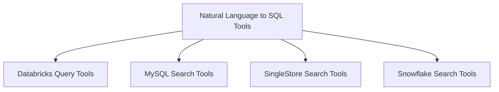

# crewai_tools_database_query

The `crewai_tools_database_query` module provides a comprehensive suite of tools designed to facilitate interaction with various database systems, enabling agents to execute SQL queries, perform semantic searches, and convert natural language into SQL. This module acts as a bridge, allowing AI agents to intelligently retrieve, analyze, and manipulate data stored in different database technologies like Databricks, MySQL, SingleStore, and Snowflake.

## Architecture Overview

The `crewai_tools_database_query` module is structured around specialized tools, each dedicated to interacting with a specific database system or handling a particular type of database operation. This modular design ensures clear separation of concerns, easy integration of new database types, and focused functionality for each tool.

<!-- DIAGRAM_JSON
{
    "direction": "TD",
    "nodes": [
        {"id": "databricks_tools", "label": "Databricks Query Tools", "type": "module", "link": "databricks_tools.md"},
        {"id": "mysql_tools", "label": "MySQL Search Tools", "type": "module", "link": "mysql_tools.md"},
        {"id": "nl2sql_tools", "label": "Natural Language to SQL Tools", "type": "module", "link": "nl2sql_tools.md"},
        {"id": "singlestore_tools", "label": "SingleStore Search Tools", "type": "module", "link": "singlestore_tools.md"},
        {"id": "snowflake_tools", "label": "Snowflake Search Tools", "type": "module", "link": "snowflake_tools.md"}
    ],
    "edges": [
        {"source": "nl2sql_tools", "target": "databricks_tools"},
        {"source": "nl2sql_tools", "target": "mysql_tools"},
        {"source": "nl2sql_tools", "target": "singlestore_tools"},
        {"source": "nl2sql_tools", "target": "snowflake_tools"}
    ],
    "groups": []
}
-->

## Sub-modules

This module is composed of the following sub-modules, each providing specific database interaction capabilities:

*   **[Databricks Query Tools](databricks_tools.md)**: This sub-module contains tools for executing SQL queries against Databricks workspace tables. It handles authentication and result formatting.
*   **[MySQL Search Tools](mysql_tools.md)**: This sub-module provides tools for performing semantic searches on the content of MySQL database tables.
*   **[Natural Language to SQL Tools](nl2sql_tools.md)**: This sub-module offers tools to convert natural language prompts into executable SQL queries and execute them against a database. It also provides mechanisms to fetch available tables and columns.
*   **[SingleStore Search Tools](singlestore_tools.md)**: This sub-module includes tools for performing semantic searches on SingleStore database tables, with support for connection pooling and query validation.
*   **[Snowflake Search Tools](snowflake_tools.md)**: This sub-module contains tools for executing both raw SQL queries and semantic searches on Snowflake data warehouses, featuring connection pooling and query caching.
