## `crewai_tools_platform_automation` Module Overview

### Purpose of the Module

The `crewai_tools_platform_automation` module provides a comprehensive suite of tools designed to enable CrewAI agents to interact with and automate various external platforms and services. It offers integrations for web scraping, data extraction, AI model evaluation, and other platform-specific actions, significantly extending the capabilities of autonomous agents to perform complex tasks across diverse ecosystems. This module acts as a bridge, allowing agents to leverage specialized third-party functionalities without needing direct, low-level integration for each service.

### Architecture of the Module

The `crewai_tools_platform_automation` module is structured as a collection of specialized sub-modules, each encapsulating tools for interacting with a particular platform or service. This modular design promotes reusability, maintainability, and clear separation of concerns.

```mermaid
graph TD
    A[crewai_tools_platform_automation] --> B(Apify Actors Tool)
    A --> C(Arxiv Paper Tool)
    A --> D(Bright Data Tools)
    A --> E(Composio Tool)
    A --> F(Contextual AI Tools)
    A --> G(CrewAI Platform Action Tool)
    A --> H(Generate CrewAI Automation Tool)
    A --> I(LlamaIndex Tool)
    A --> J(Merge Agent Handler Tool)
    A --> K(OCR Tool)
    A --> L(Oxylabs Amazon Scrapers)
    A --> M(Parallel Search Tool)
    A --> N(Patronus Evaluation Tools)
    A --> O(RAG Tool Internals)
    A --> P(Stagehand Tool)
    A --> Q(YouTube Search Tools)
    A --> R(Zapier Action Tool)

    click B "apify_actors_tool.md" "View Apify Actors Tool Documentation"
    click C "arxiv_paper_tool.md" "View Arxiv Paper Tool Documentation"
    click D "brightdata_tools.md" "View Bright Data Tools Documentation"
    click E "composio_tool.md" "View Composio Tool Documentation"
    click F "contextualai_tools.md" "View Contextual AI Tools Documentation"
    click G "crewai_platform_action_tool.md" "View CrewAI Platform Action Tool Documentation"
    click H "generate_crewai_automation_tool.md" "View Generate CrewAI Automation Tool Documentation"
    click I "llamaindex_tool.md" "View LlamaIndex Tool Documentation"
    click J "merge_agent_handler_tool.md" "View Merge Agent Handler Tool Documentation"
    click K "ocr_tool.md" "View OCR Tool Documentation"
    click L "oxylabs_amazon_scrapers.md" "View Oxylabs Amazon Scrapers Documentation"
    click M "parallel_search_tool.md" "View Parallel Search Tool Documentation"
    click N "patronus_eval_tools.md" "View Patronus Evaluation Tools Documentation"
    click O "rag_tool_internals.md" "View RAG Tool Internals Documentation"
    click P "stagehand_tool.md" "View Stagehand Tool Documentation"
    click Q "youtube_search_tools.md" "View YouTube Search Tools Documentation"
    click R "zapier_action_tool.md" "View Zapier Action Tool Documentation"
```

### References to Core Components Documentation

The `crewai_tools_platform_automation` module comprises several specialized sub-modules, each providing tools for specific platform automation tasks:

*   **[Apify Actors Tool](apify_actors_tool.md)**: Integrates with Apify Actors for web scraping and data extraction.
*   **[Arxiv Paper Tool](arxiv_paper_tool.md)**: Enables searching and downloading academic papers from Arxiv.
*   **[Bright Data Tools](brightdata_tools.md)**: Provides tools for structured data scraping and web search via Bright Data APIs.
*   **[Composio Tool](composio_tool.md)**: Facilitates integration with Composio actions for third-party application functionalities.
*   **[Contextual AI Tools](contextualai_tools.md)**: Offers tools for creating and querying RAG agents on the Contextual AI platform.
*   **[CrewAI Platform Action Tool](crewai_platform_action_tool.md)**: Allows agents to execute defined actions on the CrewAI Platform.
*   **[Generate CrewAI Automation Tool](generate_crewai_automation_tool.md)**: Interacts with CrewAI Studio API to generate automations from natural language.
*   **[LlamaIndex Tool](llamaindex_tool.md)**: Bridges CrewAI with LlamaIndex functionalities for advanced data interaction and querying.
*   **[Merge Agent Handler Tool](merge_agent_handler_tool.md)**: Enables secure interaction with third-party integrations via Merge Agent Handler.
*   **[OCR Tool](ocr_tool.md)**: Provides Optical Character Recognition capabilities for extracting text from images.
*   **[Oxylabs Amazon Scrapers](oxylabs_amazon_scrapers.md)**: Offers specialized tools for scraping Amazon product and search data using Oxylabs.
*   **[Parallel Search Tool](parallel_search_tool.md)**: Integrates with Parallel's Search API for comprehensive web searches optimized for LLMs.
*   **[Patronus Evaluation Tools](patronus_eval_tools.md)**: Provides a suite of tools for evaluating AI model inputs and outputs with the Patronus AI platform.
*   **[RAG Tool Internals](rag_tool_internals.md)**: Details the internal workings of RAG integration, including adapter management and configuration validation.
*   **[Stagehand Tool](stagehand_tool.md)**: A powerful web automation tool for natural language interaction with web browsers.
*   **[YouTube Search Tools](youtube_search_tools.md)**: Specialized tools for semantic search across YouTube channels and videos.
*   **[Zapier Action Tool](zapier_action_tool.md)**: Generates Zapier action tools, allowing agents to interact with various applications via Zapier.