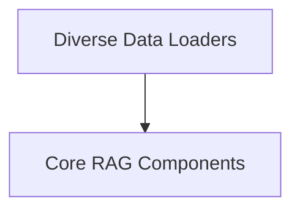

# crewai_tools_rag_loaders_and_chunkers Module Documentation

## Introduction
The `crewai_tools_rag_loaders_and_chunkers` module is a crucial component of the CrewAI RAG (Retrieval Augmented Generation) system, responsible for ingesting diverse data sources and preparing them for efficient retrieval. It provides a robust framework for loading content from various formats and breaking it down into manageable chunks suitable for language models.

## Architecture Overview
The module is structured around a set of extensible loaders and a base chunking mechanism. The core functionality is defined by abstract base classes, which are then implemented by numerous specialized loaders for different data types. This design promotes modularity, allowing for easy expansion with new data sources and chunking strategies.

<!-- DIAGRAM_JSON
{
    "direction": "TD",
    "nodes": [
        {"id": "base_components", "label": "Core RAG Components", "type": "module", "link": "base_components.md"},
        {"id": "data_loaders", "label": "Diverse Data Loaders", "type": "module", "link": "data_loaders.md"}
    ],
    "edges": [
        {"source": "data_loaders", "target": "base_components"}
    ],
    "groups": []
}
-->

## Sub-modules:

*   **[Core RAG Components](base_components.md)**: This sub-module defines the fundamental abstract classes (`BaseLoader` and `BaseChunker`) that establish the interface for all data loading and text chunking operations within the RAG system.
*   **[Diverse Data Loaders](data_loaders.md)**: This extensive sub-module contains concrete implementations of `BaseLoader`, providing capabilities to ingest data from a multitude of sources such as CSV files, directories, documentation websites, DOCX, GitHub repositories, JSON, MDX, MySQL, PDF, PostgreSQL, plain text files, web pages, XML, and YouTube channels/videos.
