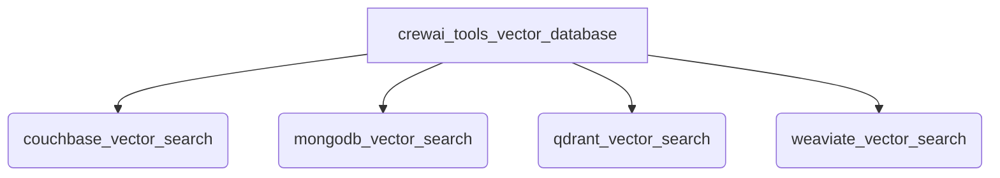

# crewai_tools_vector_database Module

## Introduction and Purpose

The `crewai_tools_vector_database` module provides a collection of specialized tools designed to facilitate vector searches across various popular vector databases. This module enables AI agents within the CrewAI framework to interact with and retrieve relevant information from vector stores such as Couchbase, MongoDB Atlas, Qdrant, and Weaviate. By abstracting the complexities of each database's API, it allows for seamless integration of vector search capabilities into agent workflows, enhancing their ability to access and utilize vectorized knowledge.

## Architecture Overview

The `crewai_tools_vector_database` module is structured around individual sub-modules, each dedicated to a specific vector database integration. Each sub-module encapsulates the logic and necessary configurations for connecting to and performing vector search operations on its respective database. These sub-modules are designed to be self-contained, promoting modularity and ease of maintenance. The module provides a unified interface through its `BaseTool` inheritance, allowing CrewAI agents to interact with different vector databases using a consistent pattern.

<!-- DIAGRAM_JSON
{
    "direction": "TD",
    "nodes": [
        {"id": "couchbase_vector_search", "label": "Couchbase Vector Search", "type": "module", "link": "couchbase_vector_search.md"},
        {"id": "mongodb_vector_search", "label": "MongoDB Vector Search", "type": "module", "link": "mongodb_vector_search.md"},
        {"id": "qdrant_vector_search", "label": "Qdrant Vector Search", "type": "module", "link": "qdrant_vector_search.md"},
        {"id": "weaviate_vector_search", "label": "Weaviate Vector Search", "type": "module", "link": "weaviate_vector_search.md"}
    ],
    "edges": [
        {"source": "crewai_tools_vector_database", "target": "couchbase_vector_search"},
        {"source": "crewai_tools_vector_database", "target": "mongodb_vector_search"},
        {"source": "crewai_tools_vector_database", "target": "qdrant_vector_search"},
        {"source": "crewai_tools_vector_database", "target": "weaviate_vector_search"}
    ],
    "groups": []
}
-->

## High-Level Functionality

### [Couchbase Vector Search](couchbase_vector_search.md)
This sub-module provides the `CouchbaseFTSVectorSearchTool`, which allows agents to perform full-text and vector searches within Couchbase databases. It handles connection management, index validation, and query execution for retrieving relevant documents based on vector embeddings.

### [MongoDB Vector Search](mongodb_vector_search.md)
This sub-module contains the `MongoDBVectorSearchTool`, enabling agents to conduct vector searches on MongoDB Atlas collections. It supports embedding generation, index creation, and advanced query configurations, including pre- and post-filtering, to retrieve documents efficiently.

### [Qdrant Vector Search](qdrant_vector_search.md)
This sub-module introduces the `QdrantVectorSearchTool`, which integrates with Qdrant vector databases to perform similarity searches. It supports custom embedding functions and allows for filtering search results based on specific criteria, returning relevant documents with their associated metadata and context.

### [Weaviate Vector Search](weaviate_vector_search.md)
This sub-module offers the `WeaviateVectorSearchTool` for interacting with Weaviate databases. It facilitates hybrid queries, combining keyword and vector-based search, to retrieve pertinent information from Weaviate collections, handling client connections and collection management.
