# `crewai_tools_web_scraping` Module Documentation

## Introduction
The `crewai_tools_web_scraping` module provides a comprehensive suite of tools designed for various web scraping and crawling tasks. It integrates with a multitude of third-party services and libraries, offering solutions for bypassing bot protection, loading dynamic content, intelligent scraping, and converting web pages into LLM-friendly formats like Markdown. This module is essential for agents that require robust and flexible access to web content for information gathering, data extraction, and content analysis.

## Architecture
The `crewai_tools_web_scraping` module acts as an aggregator of various specialized web scraping and crawling tools. Each tool typically wraps a specific external API or library, providing a standardized interface for `crewAI` agents to interact with web resources. The architecture emphasizes modularity, allowing new scraping capabilities to be easily integrated.

<!-- DIAGRAM_JSON
{
    "direction": "TD",
    "nodes": [
        {"id": "web_scraping_module", "label": "crewai_tools_web_scraping", "type": "module"},
        {"id": "brightdata_integration", "label": "Bright Data Integration", "type": "module", "link": "brightdata_integration.md"},
        {"id": "browserbase_integration", "label": "Browserbase Integration", "type": "module", "link": "browserbase_integration.md"},
        {"id": "firecrawl_integration", "label": "Firecrawl Integration", "type": "module", "link": "firecrawl_integration.md"},
        {"id": "hyperbrowser_integration", "label": "Hyperbrowser Integration", "type": "module", "link": "hyperbrowser_integration.md"},
        {"id": "jina_integration", "label": "Jina AI Integration", "type": "module", "link": "jina_integration.md"},
        {"id": "multion_integration", "label": "MultiOn Integration", "type": "module", "link": "multion_integration.md"},
        {"id": "oxylabs_integration", "label": "Oxylabs Integration", "type": "module", "link": "oxylabs_integration.md"},
        {"id": "basic_web_scraping", "label": "Basic Web Scraping", "type": "module", "link": "basic_web_scraping.md"},
        {"id": "scrapegraph_integration", "label": "Scrapegraph AI Integration", "type": "module", "link": "scrapegraph_integration.md"},
        {"id": "scrapfly_integration", "label": "Scrapfly Integration", "type": "module", "link": "scrapfly_integration.md"},
        {"id": "selenium_integration", "label": "Selenium Scraping", "type": "module", "link": "selenium_integration.md"},
        {"id": "serper_integration", "label": "Serper Integration", "type": "module", "link": "serper_integration.md"},
        {"id": "serply_integration", "label": "Serply Integration", "type": "module", "link": "serply_integration.md"},
        {"id": "spider_integration", "label": "Spider Tool Integration", "type": "module", "link": "spider_integration.md"},
        {"id": "tavily_integration", "label": "Tavily Extractor Integration", "type": "module", "link": "tavily_integration.md"}
    ],
    "edges": [
        {"source": "web_scraping_module", "target": "brightdata_integration"},
        {"source": "web_scraping_module", "target": "browserbase_integration"},
        {"source": "web_scraping_module", "target": "firecrawl_integration"},
        {"source": "web_scraping_module", "target": "hyperbrowser_integration"},
        {"source": "web_scraping_module", "target": "jina_integration"},
        {"source": "web_scraping_module", "target": "multion_integration"},
        {"source": "web_scraping_module", "target": "oxylabs_integration"},
        {"source": "web_scraping_module", "target": "basic_web_scraping"},
        {"source": "web_scraping_module", "target": "scrapegraph_integration"},
        {"source": "web_scraping_module", "target": "scrapfly_integration"},
        {"source": "web_scraping_module", "target": "selenium_integration"},
        {"source": "web_scraping_module", "target": "serper_integration"},
        {"source": "web_scraping_module", "target": "serply_integration"},
        {"source": "web_scraping_module", "target": "spider_integration"},
        {"source": "web_scraping_module", "target": "tavily_integration"}
    ],
    "groups": []
}
-->

```mermaid
graph TD
    web_scraping_module[crewai_tools_web_scraping] --> brightdata_integration[Bright Data Integration]
    web_scraping_module --> browserbase_integration[Browserbase Integration]
    web_scraping_module --> firecrawl_integration[Firecrawl Integration]
    web_scraping_module --> hyperbrowser_integration[Hyperbrowser Integration]
    web_scraping_module --> jina_integration[Jina AI Integration]
    web_scraping_module --> multion_integration[MultiOn Integration]
    web_scraping_module --> oxylabs_integration[Oxylabs Integration]
    web_scraping_module --> basic_web_scraping[Basic Web Scraping]
    web_scraping_module --> scrapegraph_integration[Scrapegraph AI Integration]
    web_scraping_module --> scrapfly_integration[Scrapfly Integration]
    web_scraping_module --> selenium_integration[Selenium Scraping]
    web_scraping_module --> serper_integration[Serper Integration]
    web_scraping_module --> serply_integration[Serply Integration]
    web_scraping_module --> spider_integration[Spider Tool Integration]
    web_scraping_module --> tavily_integration[Tavily Extractor Integration]

    click brightdata_integration "brightdata_integration.md" "View Bright Data Integration Docs"
    click browserbase_integration "browserbase_integration.md" "View Browserbase Integration Docs"
    click firecrawl_integration "firecrawl_integration.md" "View Firecrawl Integration Docs"
    click hyperbrowser_integration "hyperbrowser_integration.md" "View Hyperbrowser Integration Docs"
    click jina_integration "jina_integration.md" "View Jina AI Integration Docs"
    click multion_integration "multion_integration.md" "View MultiOn Integration Docs"
    click oxylabs_integration "oxylabs_integration.md" "View Oxylabs Integration Docs"
    click basic_web_scraping "basic_web_scraping.md" "View Basic Web Scraping Docs"
    click scrapegraph_integration "scrapegraph_integration.md" "View Scrapegraph AI Integration Docs"
    click scrapfly_integration "scrapfly_integration.md" "View Scrapfly Integration Docs"
    click selenium_integration "selenium_integration.md" "View Selenium Scraping Docs"
    click serper_integration "serper_integration.md" "View Serper Integration Docs"
    click serply_integration "serply_integration.md" "View Serply Integration Docs"
    click spider_integration "spider_integration.md" "View Spider Tool Integration Docs"
    click tavily_integration "tavily_integration.md" "View Tavily Extractor Integration Docs"
```

## Sub-modules Overview

### [Basic Web Scraping](basic_web_scraping.md)
Provides fundamental tools for scraping website content and specific HTML elements using `requests` and `BeautifulSoup`. This includes `ScrapeElementFromWebsiteTool` for targeted element extraction and `ScrapeWebsiteTool` for general page content.

### [Bright Data Integration](brightdata_integration.md)
Facilitates web scraping using the Bright Data Web Unlocker API, designed to bypass common bot protection mechanisms like CAPTCHAs and geo-restrictions, returning raw or markdown formatted content.

### [Browserbase Integration](browserbase_integration.md)
Offers tools for loading web pages in a headless browser using Browserbase. This is particularly useful for scraping dynamic content rendered by JavaScript.

### [Firecrawl Integration](firecrawl_integration.md)
Provides tools for both crawling entire websites and scraping individual web pages using the Firecrawl v2 API. It supports various configuration options for content formats, main content extraction, and handling external links.

### [Hyperbrowser Integration](hyperbrowser_integration.md)
Enables scraping and crawling web pages with advanced content extraction capabilities via the Hyperbrowser API. It supports returning content in markdown or HTML formats and offers options for session and scrape configurations.

### [Jina AI Integration](jina_integration.md)
Tool for efficiently reading website content and returning it in a clean, markdown format using the Jina.ai reader service.

### [MultiOn Integration](multion_integration.md)
Allows Large Language Models (LLMs) to control web browsers using natural language instructions. This tool is ideal for automating complex web interactions.

### [Oxylabs Integration](oxylabs_integration.md)
A universal scraper tool for accessing and extracting content from any website using the Oxylabs API, providing robust scraping capabilities.

### [Scrapegraph AI Integration](scrapegraph_integration.md)
Intelligently scrapes website content guided by user prompts using Scrapegraph AI. It's designed for smart content extraction and handles various API interactions and error scenarios.

### [Scrapfly Integration](scrapfly_integration.md)
Scrapes web pages and returns their content as markdown or text using the Scrapfly API. It supports custom scrape configurations and includes error handling for failed scrapes.

### [Selenium Scraping](selenium_integration.md)
Utilizes Selenium for advanced web scraping, including handling dynamic content, simulating user interactions, and extracting specific elements or full HTML from a website.

### [Serper Integration](serper_integration.md)
Scrapes website content using Serper's dedicated scraping API. It can extract clean, readable content and optionally include markdown formatting for better structure.

### [Serply Integration](serply_integration.md)
Converts webpages into markdown format, making the content easier for LLMs to understand and process, using the Serply API.

### [Spider Tool Integration](spider_integration.md)
Provides robust tools for scraping individual web pages or crawling multiple pages, designed to return LLM-ready content using the Spider.cloud API. It includes URL validation and error logging.

### [Tavily Extractor Integration](tavily_integration.md)
Extracts structured content from web pages using the Tavily API. It offers different extraction depths (basic or advanced) and options for including images in the extracted data.