# crewai_tools_web_search Module Documentation

## Introduction
The `crewai_tools_web_search` module provides a comprehensive suite of tools designed to enable AI agents within the CrewAI framework to perform various types of web searches and data extraction. These tools integrate with several third-party search APIs, offering functionalities ranging from general web searches to specialized queries for local points of interest, news articles, academic literature, and job postings. The module aims to equip agents with robust information-gathering capabilities from the internet.

## Architecture Overview
The module is structured around a collection of specialized search tools, each designed to interface with a particular web search or data scraping API. A base class, `BraveSearchToolBase`, provides common functionalities like API key handling, rate limiting, and request/response processing for Brave Search-related tools. Separate schemas define the expected headers and parameters for different search endpoints. The design emphasizes modularity, allowing for easy integration of new search providers and flexible usage within CrewAI agents.

<!-- DIAGRAM_JSON
{
    "direction": "TD",
    "nodes": [
        {"id": "brave_search_integration", "label": "Brave Search Integration", "type": "module", "link": "brave_search_integration.md"},
        {"id": "search_api_schemas", "label": "Search API Schemas", "type": "module", "link": "search_api_schemas.md"},
        {"id": "exa_integration", "label": "Exa Search Integration", "type": "module", "link": "exa_integration.md"},
        {"id": "firecrawl_integration", "label": "Firecrawl Search Integration", "type": "module", "link": "firecrawl_integration.md"},
        {"id": "oxylabs_integration", "label": "Oxylabs Search Integration", "type": "module", "link": "oxylabs_integration.md"},
        {"id": "serpapi_integration", "label": "SerpApi Base Integration", "type": "module", "link": "serpapi_integration.md"},
        {"id": "serper_dev_integration", "label": "Serper.dev Search Integration", "type": "module", "link": "serper_dev_integration.md"},
        {"id": "serply_integration", "label": "Serply API Integration", "type": "module", "link": "serply_integration.md"},
        {"id": "tavily_integration", "label": "Tavily Search Integration", "type": "module", "link": "tavily_integration.md"},
        {"id": "website_search", "label": "Website Specific Search", "type": "module", "link": "website_search.md"}
    ],
    "edges": [
        {"source": "brave_search_integration", "target": "search_api_schemas"},
        {"source": "crewai_tools_web_search", "target": "brave_search_integration"},
        {"source": "crewai_tools_web_search", "target": "exa_integration"},
        {"source": "crewai_tools_web_search", "target": "firecrawl_integration"},
        {"source": "crewai_tools_web_search", "target": "oxylabs_integration"},
        {"source": "crewai_tools_web_search", "target": "serpapi_integration"},
        {"source": "crewai_tools_web_search", "target": "serper_dev_integration"},
        {"source": "crewai_tools_web_search", "target": "serply_integration"},
        {"source": "crewai_tools_web_search", "target": "tavily_integration"},
        {"source": "crewai_tools_web_search", "target": "website_search"}
    ],
    "groups": [
        {"id": "crewai_tools_web_search", "label": "crewai_tools_web_search", "nodes": ["brave_search_integration", "exa_integration", "firecrawl_integration", "oxylabs_integration", "serpapi_integration", "serper_dev_integration", "serply_integration", "tavily_integration", "website_search", "search_api_schemas"]}
    ]
}
-->

```mermaid
graph TD
    crewai_tools_web_search[Web Search Module]
    brave_search_integration[Brave Search Integration]
    search_api_schemas[Search API Schemas]
    exa_integration[Exa Search Integration]
    firecrawl_integration[Firecrawl Search Integration]
    oxylabs_integration[Oxylabs Search Integration]
    serpapi_integration[SerpApi Base Integration]
    serper_dev_integration[Serper.dev Search Integration]
    serply_integration[Serply API Integration]
    tavily_integration[Tavily Search Integration]
    website_search[Website Specific Search]

    crewai_tools_web_search --> brave_search_integration
    crewai_tools_web_search --> exa_integration
    crewai_tools_web_search --> firecrawl_integration
    crewai_tools_web_search --> oxylabs_integration
    crewai_tools_web_search --> serpapi_integration
    crewai_tools_web_search --> serper_dev_integration
    crewai_tools_web_search --> serply_integration
    crewai_tools_web_search --> tavily_integration
    crewai_tools_web_search --> website_search
    brave_search_integration --> search_api_schemas

    click brave_search_integration "brave_search_integration.md" "View Brave Search Integration Documentation"
    click search_api_schemas "search_api_schemas.md" "View Search API Schemas Documentation"
    click exa_integration "exa_integration.md" "View Exa Search Integration Documentation"
    click firecrawl_integration "firecrawl_integration.md" "View Firecrawl Search Integration Documentation"
    click oxylabs_integration "oxylabs_integration.md" "View Oxylabs Search Integration Documentation"
    click serpapi_integration "serpapi_integration.md" "View SerpApi Base Integration Documentation"
    click serper_dev_integration "serper_dev_integration.md" "View Serper.dev Search Integration Documentation"
    click serply_integration "serply_integration.md" "View Serply API Integration Documentation"
    click tavily_integration "tavily_integration.md" "View Tavily Search Integration Documentation"
    click website_search "website_search.md" "View Website Specific Search Documentation"
```

## Sub-modules

This module is composed of the following sub-modules, each providing specialized web search capabilities:

*   ### [Brave Search Integration](brave_search_integration.md)
    Provides tools for interacting with the Brave Search API, including general web search and local Points of Interest (POIs).

*   ### [Search API Schemas](search_api_schemas.md)
    Defines Pydantic models for various Brave Search API request headers and parameters.

*   ### [Exa Search Integration](exa_integration.md)
    Tool for performing web searches using the Exa API.

*   ### [Firecrawl Search Integration](firecrawl_integration.md)
    Tool for searching and scraping webpages using the Firecrawl API.

*   ### [Oxylabs Search Integration](oxylabs_integration.md)
    Tool for scraping Google Search results through the Oxylabs API.

*   ### [SerpApi Base Integration](serpapi_integration.md)
    Provides a base class for integrating with the SerpApi search service.

*   ### [Serper.dev Search Integration](serper_dev_integration.md)
    Tool for performing web and news searches using the Serper.dev API.

*   ### [Serply API Integration](serply_integration.md)
    A suite of tools for job, news, scholarly, and general web searches using the Serply API.

*   ### [Tavily Search Integration](tavily_integration.md)
    Tool for conducting comprehensive web searches with various options using the Tavily Search API.

*   ### [Website Specific Search](website_search.md)
    Tool for performing semantic searches within a specified website's content.
