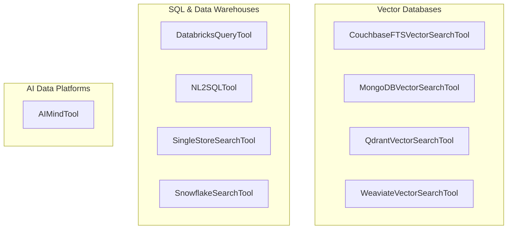

# data_and_vector_stores
This module provides a collection of tools for interacting with various data stores, including vector databases, SQL databases, and AI data platforms, enabling diverse data retrieval and querying capabilities.

<!-- DIAGRAM_JSON
{
  "nodes": [
    {"id": "AIMindTool", "label": "AIMindTool"},
    {"id": "CouchbaseFTSVectorSearchTool", "label": "CouchbaseFTSVectorSearchTool"},
    {"id": "DatabricksQueryTool", "label": "DatabricksQueryTool"},
    {"id": "MongoDBVectorSearchTool", "label": "MongoDBVectorSearchTool"},
    {"id": "NL2SQLTool", "label": "NL2SQLTool"},
    {"id": "QdrantVectorSearchTool", "label": "QdrantVectorSearchTool"},
    {"id": "SingleStoreSearchTool", "label": "SingleStoreSearchTool"},
    {"id": "SnowflakeSearchTool", "label": "SnowflakeSearchTool"},
    {"id": "WeaviateVectorSearchTool", "label": "WeaviateVectorSearchTool"}
  ],
  "edges": [],
  "groups": [
    {"id": "vector_dbs", "label": "Vector Databases", "nodes": ["CouchbaseFTSVectorSearchTool", "MongoDBVectorSearchTool", "QdrantVectorSearchTool", "WeaviateVectorSearchTool"]},
    {"id": "sql_data_warehouses", "label": "SQL & Data Warehouses", "nodes": ["DatabricksQueryTool", "NL2SQLTool", "SingleStoreSearchTool", "SnowflakeSearchTool"]},
    {"id": "ai_data_platforms", "label": "AI Data Platforms", "nodes": ["AIMindTool"]}
  ]
}
-->
