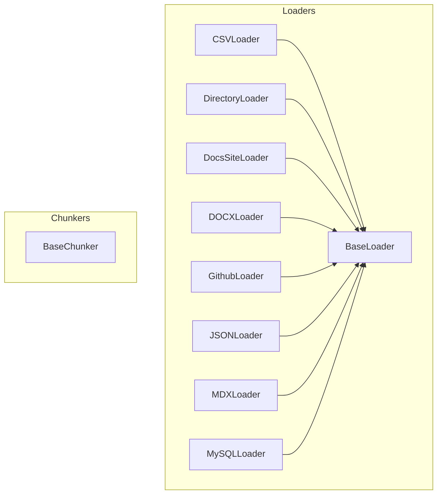

# data_loaders
The `data_loaders` module provides a collection of classes for loading and processing diverse data sources, including files, web content, and databases, along with text chunking capabilities.

<!-- DIAGRAM_JSON
{
    "nodes": [
        {
            "id": "data_loaders",
            "label": "data_loaders",
            "type": "module"
        },
        {
            "id": "BaseLoader",
            "label": "BaseLoader"
        },
        {
            "id": "BaseChunker",
            "label": "BaseChunker"
        },
        {
            "id": "CSVLoader",
            "label": "CSVLoader"
        },
        {
            "id": "DirectoryLoader",
            "label": "DirectoryLoader"
        },
        {
            "id": "DocsSiteLoader",
            "label": "DocsSiteLoader"
        },
        {
            "id": "DOCXLoader",
            "label": "DOCXLoader"
        },
        {
            "id": "GithubLoader",
            "label": "GithubLoader"
        },
        {
            "id": "JSONLoader",
            "label": "JSONLoader"
        },
        {
            "id": "MDXLoader",
            "label": "MDXLoader"
        },
        {
            "id": "MySQLLoader",
            "label": "MySQLLoader"
        },
        {
            "id": "document_and_file_loaders",
            "label": "Document and File Loaders",
            "type": "module",
            "link": "document_and_file_loaders.md"
        },
        {
            "id": "web_and_database_loaders",
            "label": "Web and Database Loaders",
            "type": "module",
            "link": "web_and_database_loaders.md"
        },
        {
            "id": "base_rag_components",
            "label": "Base RAG Components",
            "type": "module",
            "link": "base_rag_components.md"
        }
    ],
    "edges": [
        {
            "source": "CSVLoader",
            "target": "BaseLoader",
            "label": "inherits"
        },
        {
            "source": "DirectoryLoader",
            "target": "BaseLoader",
            "label": "inherits"
        },
        {
            "source": "DocsSiteLoader",
            "target": "BaseLoader",
            "label": "inherits"
        },
        {
            "source": "DOCXLoader",
            "target": "BaseLoader",
            "label": "inherits"
        },
        {
            "source": "GithubLoader",
            "target": "BaseLoader",
            "label": "inherits"
        },
        {
            "source": "JSONLoader",
            "target": "BaseLoader",
            "label": "inherits"
        },
        {
            "source": "MDXLoader",
            "target": "BaseLoader",
            "label": "inherits"
        },
        {
            "source": "MySQLLoader",
            "target": "BaseLoader",
            "label": "inherits"
        },
        {
            "source": "data_loaders",
            "target": "document_and_file_loaders"
        },
        {
            "source": "data_loaders",
            "target": "web_and_database_loaders"
        },
        {
            "source": "data_loaders",
            "target": "base_rag_components"
        }
    ],
    "groups": [
        {
            "id": "Loaders",
            "label": "Loaders",
            "nodes": [
                "BaseLoader",
                "CSVLoader",
                "DirectoryLoader",
                "DocsSiteLoader",
                "DOCXLoader",
                "GithubLoader",
                "JSONLoader",
                "MDXLoader",
                "MySQLLoader"
            ]
        },
        {
            "id": "Chunkers",
            "label": "Chunkers",
            "nodes": [
                "BaseChunker"
            ]
        }
    ]
}
-->
