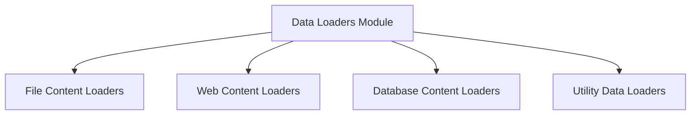

# Data Loaders Module

## Introduction and Purpose

The `data_loaders` module, part of `crewai_tools_rag_loaders_and_chunkers`, is a crucial component responsible for ingesting diverse forms of data from various sources. It provides a standardized interface for loading content from local files, web resources, and databases, transforming them into a format suitable for further processing within the CrewAI RAG system. This module ensures that the RAG system has access to a wide array of information, enabling it to retrieve relevant context effectively.

## Architecture Overview

The `data_loaders` module is structured into several sub-modules, each specializing in a particular category of data sources. This modular design promotes maintainability, extensibility, and clear separation of concerns.

<!-- DIAGRAM_JSON
{
    "direction": "TD",
    "nodes": [
        {"id": "data_loaders", "label": "Data Loaders Module", "type": "module"},
        {"id": "file_loaders", "label": "File Content Loaders", "type": "module", "link": "file_loaders.md"},
        {"id": "web_loaders", "label": "Web Content Loaders", "type": "module", "link": "web_loaders.md"},
        {"id": "database_loaders", "label": "Database Content Loaders", "type": "module", "link": "database_loaders.md"},
        {"id": "utility_loaders", "label": "Utility Data Loaders", "type": "module", "link": "utility_loaders.md"}
    ],
    "edges": [
        {"source": "data_loaders", "target": "file_loaders"},
        {"source": "data_loaders", "target": "web_loaders"},
        {"source": "data_loaders", "target": "database_loaders"},
        {"source": "data_loaders", "target": "utility_loaders"}
    ],
    "groups": []
}
-->

## High-Level Functionality

The module is composed of the following sub-modules:

*   **[File Content Loaders](file_loaders.md)**: This sub-module is dedicated to processing and extracting content from various file types, including CSV, DOCX, JSON, MDX, PDF, plain text, and XML. It handles the specific parsing logic for each format, ensuring that structured and unstructured data can be effectively ingested.

*   **[Web Content Loaders](web_loaders.md)**: This section focuses on retrieving and parsing content from online sources. It includes loaders for documentation websites, GitHub repositories (code, issues, PRs), generic webpages, and YouTube channels and videos (transcripts and metadata).

*   **[Database Content Loaders](database_loaders.md)**: This sub-module provides capabilities to connect to and query relational databases like MySQL and PostgreSQL. It allows for the execution of SQL queries to fetch data, which is then formatted for integration into the RAG system.

*   **[Utility Data Loaders](utility_loaders.md)**: This sub-module contains general-purpose loaders, such as the `DirectoryLoader` for recursively processing files within a specified directory, and a `TextLoader` for directly handling raw string content. These loaders offer flexible solutions for various data ingestion scenarios.

## Relationship with `crewai_tools_rag_loaders_and_chunkers`

The `data_loaders` module is an integral part of the `crewai_tools_rag_loaders_and_chunkers` module. It serves as the initial data ingestion layer, providing raw or semi-processed content that the `chunkers` sub-module can then segment and optimize for the Retrieval Augmented Generation (RAG) process. This clear separation allows for specialized handling of data loading independently from how the data is prepared for retrieval.