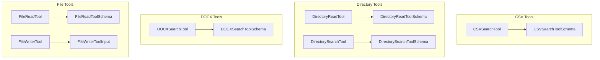

# data_processing_tools
This module provides a collection of tools for processing and interacting with various data sources, including CSV, DOCX, and file systems.

<!-- DIAGRAM_JSON
{
  "nodes": [
    {"id": "CSVSearchTool", "label": "CSVSearchTool"},
    {"id": "CSVSearchToolSchema", "label": "CSVSearchToolSchema"},
    {"id": "DirectoryReadTool", "label": "DirectoryReadTool"},
    {"id": "DirectoryReadToolSchema", "label": "DirectoryReadToolSchema"},
    {"id": "DirectorySearchTool", "label": "DirectorySearchTool"},
    {"id": "DirectorySearchToolSchema", "label": "DirectorySearchToolSchema"},
    {"id": "DOCXSearchTool", "label": "DOCXSearchTool"},
    {"id": "DOCXSearchToolSchema", "label": "DOCXSearchToolSchema"},
    {"id": "FileReadTool", "label": "FileReadTool"},
    {"id": "FileReadToolSchema", "label": "FileReadToolSchema"},
    {"id": "FileWriterTool", "label": "FileWriterTool"},
    {"id": "FileWriterToolInput", "label": "FileWriterToolInput"}
  ],
  "edges": [
    {"source": "CSVSearchTool", "target": "CSVSearchToolSchema", "label": "uses"},
    {"source": "DirectoryReadTool", "target": "DirectoryReadToolSchema", "label": "uses"},
    {"source": "DirectorySearchTool", "target": "DirectorySearchToolSchema", "label": "uses"},
    {"source": "DOCXSearchTool", "target": "DOCXSearchToolSchema", "label": "uses"},
    {"source": "FileReadTool", "target": "FileReadToolSchema", "label": "uses"},
    {"source": "FileWriterTool", "target": "FileWriterToolInput", "label": "uses"}
  ],
  "groups": [
    {"id": "csv_tools", "label": "CSV Tools", "nodes": ["CSVSearchTool", "CSVSearchToolSchema"]},
    {"id": "directory_tools", "label": "Directory Tools", "nodes": ["DirectoryReadTool", "DirectoryReadToolSchema", "DirectorySearchTool", "DirectorySearchToolSchema"]},
    {"id": "docx_tools", "label": "DOCX Tools", "nodes": ["DOCXSearchTool", "DOCXSearchToolSchema"]},
    {"id": "file_tools", "label": "File Tools", "nodes": ["FileReadTool", "FileReadToolSchema", "FileWriterTool", "FileWriterToolInput"]}
  ]
}
-->
