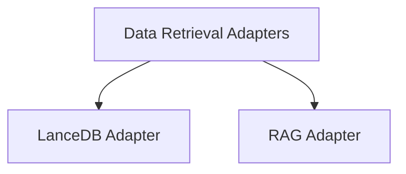

# Data Retrieval Adapters Module

## Introduction

The `data_retrieval_adapters` module provides a set of interfaces for integrating various data retrieval mechanisms into the CrewAI ecosystem. These adapters allow agents to interact with different data stores and retrieval systems, enabling them to fetch relevant information for their tasks.

## Architecture Overview

The module is composed of individual adapter sub-modules, each designed to interface with a specific data retrieval technology or pattern. This modular approach ensures flexibility and extensibility, allowing new data sources to be easily integrated.

<!-- DIAGRAM_JSON
{
    "direction": "TD",
    "nodes": [
        {"id": "lancedb_adapter", "label": "LanceDB Adapter", "type": "module", "link": "lancedb_adapter.md"},
        {"id": "rag_adapter", "label": "RAG Adapter", "type": "module", "link": "rag_adapter.md"}
    ],
    "edges": [
        {"source": "data_retrieval_adapters", "target": "lancedb_adapter"},
        {"source": "data_retrieval_adapters", "target": "rag_adapter"}
    ],
    "groups": []
}
-->

## Sub-modules

### [LanceDB Adapter](lancedb_adapter.md)
Provides an interface for interacting with LanceDB, a columnar data store for AI. It supports vector embedding and querying.

### [RAG Adapter](rag_adapter.md)
Facilitates Retrieval-Augmented Generation (RAG) by integrating with a RAG system for querying and adding data.
