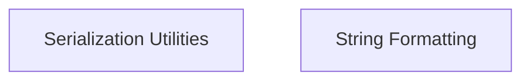

# Data Serialization and Formatting Module

## Introduction
The `data_serialization_and_formatting` module within `crewai_utilities` is responsible for handling the transformation of data into various formats suitable for storage, transmission, and display. It provides essential utilities for serializing complex Python objects into standardized string representations (like JSON) and for formatting strings into clean, URL-safe slugs.

## Architecture Overview
The module is composed of two primary sub-modules: `serialization_utilities` and `string_formatting`. These sub-modules encapsulate distinct but related functionalities, ensuring a clear separation of concerns while contributing to the overall data preparation capabilities of the system.

<!-- DIAGRAM_JSON
{
    "direction": "TD",
    "nodes": [
        {"id": "serialization_utilities", "label": "Serialization Utilities", "type": "module", "link": "serialization_utilities.md"},
        {"id": "string_formatting", "label": "String Formatting", "type": "module", "link": "string_formatting.md"}
    ],
    "edges": [],
    "groups": []
}
-->

## Sub-modules

### Serialization Utilities
This sub-module focuses on converting Python objects into serializable formats, primarily JSON. It ensures that data can be easily stored or transmitted across different parts of a system or to external services.

[Learn more about Serialization Utilities](serialization_utilities.md)

### String Formatting
This sub-module provides utilities for cleaning and standardizing string data, such as creating URL-friendly slugs. It's crucial for tasks requiring consistent and safe string representations.

[Learn more about String Formatting](string_formatting.md)