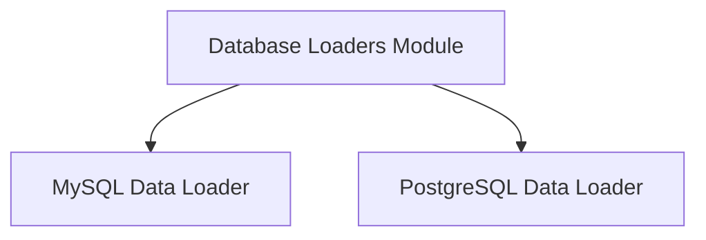

# Database Loaders Module

The `database_loaders` module provides specialized tools for extracting and loading data from various relational databases. It abstracts the complexities of database connections and query execution, allowing other modules to easily integrate data from structured sources into RAG (Retrieval-Augmented Generation) workflows.

## Architecture Overview

The `database_loaders` module acts as a bridge between the application and different database systems. Each loader within this module is responsible for connecting to a specific type of database, executing a given SQL query, and formatting the results into a standardized `LoaderResult` object. This modular design ensures extensibility and maintainability, allowing for easy addition of new database connectors.

<!-- DIAGRAM_JSON
{
    "direction": "TD",
    "nodes": [
        {"id": "mysql_loader", "label": "MySQL Data Loader", "type": "module", "link": "mysql_loader.md"},
        {"id": "postgres_loader", "label": "PostgreSQL Data Loader", "type": "module", "link": "postgres_loader.md"}
    ],
    "edges": [
        {"source": "database_loaders", "target": "mysql_loader"},
        {"source": "database_loaders", "target": "postgres_loader"}
    ],
    "groups": []
}
-->

## Sub-modules

This module contains the following sub-modules, each dedicated to a specific database system:

*   ### [MySQL Data Loader](mysql_loader.md)
    This sub-module provides the `MySQLLoader` component, which is designed to connect to MySQL databases, execute SQL queries, and retrieve the results. It handles connection parameters, query execution, and result formatting, making it straightforward to integrate MySQL data.

*   ### [PostgreSQL Data Loader](postgres_loader.md)
    This sub-module offers the `PostgresLoader` component, tailored for interacting with PostgreSQL databases. Similar to the MySQL loader, it manages PostgreSQL connections, runs SQL queries, and returns the fetched data in a structured format, simplifying data retrieval from PostgreSQL instances.
