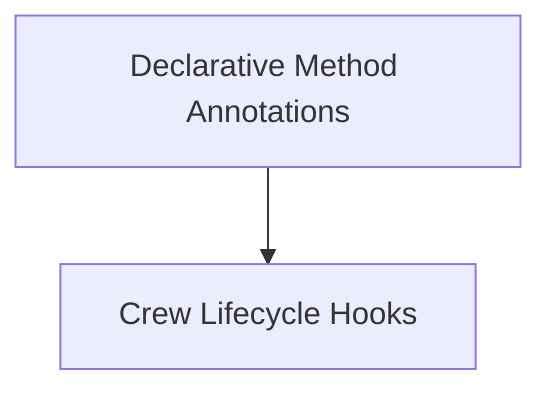

# Declarative Annotations Module

The `declarative_annotations` module provides a set of decorators to declaratively define the roles and lifecycle hooks for methods within a CrewAI project. This allows developers to clearly mark methods as agents, tasks, LLMs, tools, or define actions to be executed before and after the crew's kickoff.

## Architecture Overview

The module is structured into two main sub-modules:

- **[Declarative Method Annotations](declarative_methods.md)**: Focuses on core declarative annotations for defining crew components.
- **[Crew Lifecycle Hooks](lifecycle_hooks.md)**: Manages annotations for methods that respond to crew lifecycle events.

These sub-modules work together to provide a clear and organized way to define crew behavior and structure.

<!-- DIAGRAM_JSON
{
    "direction": "TD",
    "nodes": [
        {"id": "declarative_methods", "label": "Declarative Method Annotations", "type": "module", "link": "declarative_methods.md"},
        {"id": "lifecycle_hooks", "label": "Crew Lifecycle Hooks", "type": "module", "link": "lifecycle_hooks.md"}
    ],
    "edges": [
        {"source": "declarative_methods", "target": "lifecycle_hooks"}
    ],
    "groups": []
}
-->

