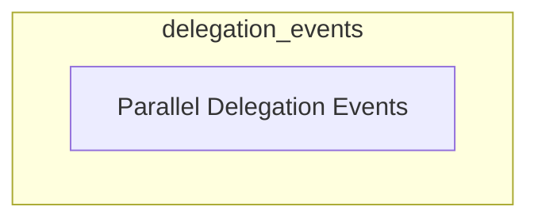

# Delegation Events Module

The `delegation_events` module is a crucial component within the `crewai_event_system`, specifically designed to manage and broadcast events related to the parallel delegation of tasks to multiple Agent-to-Agent (A2A) agents. It provides a standardized mechanism for other modules to be notified when a parallel delegation process starts and completes.

## Architecture Overview

This module primarily consists of event definitions that capture the lifecycle of parallel delegation. It integrates with the broader `crewai_event_system` for event publishing and consumption. The core functionality revolves around two distinct events, indicating the beginning and conclusion of a parallel delegation operation.

<!-- DIAGRAM_JSON
{
    "direction": "TD",
    "nodes": [
        {"id": "parallel_delegation_events", "label": "Parallel Delegation Events", "type": "module", "link": "parallel_delegation_events.md"}
    ],
    "edges": [],
    "groups": []
}
-->

## Sub-modules

### [Parallel Delegation Events](parallel_delegation_events.md)
This sub-module defines the events that signify the start and completion of parallel delegation processes to multiple A2A agents. It includes event structures for capturing relevant details such as agent endpoints, task descriptions, and outcomes of the delegation.