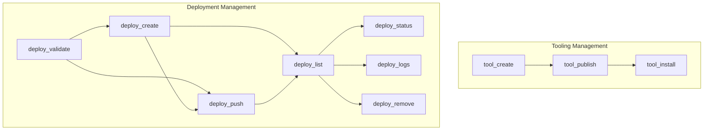

# deployment_and_tooling
This module provides command-line interface functions for managing both custom tools and CrewAI deployments, covering creation, publishing, installation, and full deployment lifecycle operations.

<!-- DIAGRAM_JSON
{
  "nodes": [
    {"id": "tool_create", "label": "tool_create"},
    {"id": "tool_install", "label": "tool_install"},
    {"id": "tool_publish", "label": "tool_publish"},
    {"id": "deploy_push", "label": "deploy_push"},
    {"id": "deploy_create", "label": "deploy_create"},
    {"id": "deploy_list", "label": "deploy_list"},
    {"id": "deploy_status", "label": "deploy_status"},
    {"id": "deploy_logs", "label": "deploy_logs"},
    {"id": "deploy_remove", "label": "deploy_remove"},
    {"id": "deploy_validate", "label": "deploy_validate"}
  ],
  "edges": [
    {"source": "tool_create", "target": "tool_publish"},
    {"source": "tool_publish", "target": "tool_install"},
    {"source": "deploy_validate", "target": "deploy_create"},
    {"source": "deploy_validate", "target": "deploy_push"},
    {"source": "deploy_create", "target": "deploy_push"},
    {"source": "deploy_create", "target": "deploy_list"},
    {"source": "deploy_push", "target": "deploy_list"},
    {"source": "deploy_list", "target": "deploy_status"},
    {"source": "deploy_list", "target": "deploy_logs"},
    {"source": "deploy_list", "target": "deploy_remove"}
  ],
  "groups": [
    {"id": "tooling_management", "label": "Tooling Management", "nodes": ["tool_create", "tool_install", "tool_publish"]},
    {"id": "deployment_management", "label": "Deployment Management", "nodes": ["deploy_push", "deploy_create", "deploy_list", "deploy_status", "deploy_logs", "deploy_remove", "deploy_validate"]}
  ]
}
-->
