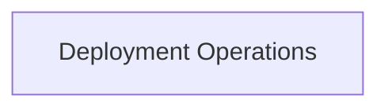

# Deployment Lifecycle Management

The `deployment_lifecycle_management` module is a core component of the CrewAI CLI, responsible for managing the complete lifecycle of Crew deployments. It provides functionalities to create, update (push), and remove deployed Crews, ensuring seamless control over your AI agent systems.

## Architecture Overview

This module interacts with the underlying deployment mechanisms to facilitate the creation, pushing of updates, and removal of Crew AI deployments. It relies on a `DeployCommand` utility to execute these operations, abstracting the complexities of the deployment process.

<!-- DIAGRAM_JSON
{
    "direction": "TD",
    "nodes": [
        {"id": "deployment_operations", "label": "Deployment Operations", "type": "module", "link": "deployment_operations.md"}
    ],
    "edges": [],
    "groups": []
}
-->

## Sub-modules

* **[Deployment Operations](deployment_operations.md)**: This sub-module contains the core logic for initiating and managing deployment actions, including creating new deployments, pushing updates, and removing existing ones.