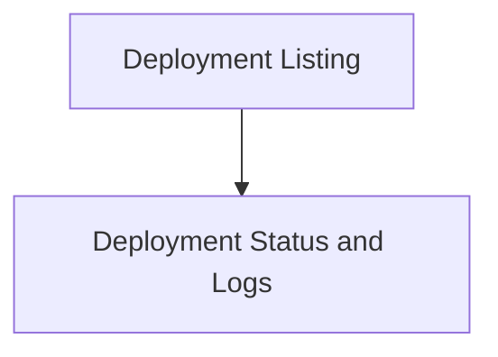

# Deployment Monitoring and Query

## Introduction

The `deployment_monitoring_and_query` module is a critical component within the `crewai_cli` responsible for providing command-line interface functionalities related to managing and monitoring crew deployments. It allows users to list deployments, check their status, and retrieve logs, offering essential tools for operational oversight.

## Architecture Overview

This module is part of the `crewai_cli.crew_deployment_management` sub-system. It interacts with the `DeployCommand` to execute its core functionalities. The architecture is straightforward, with dedicated sub-modules for listing deployments and for retrieving status and logs.

<!-- DIAGRAM_JSON
{
    "direction": "TD",
    "nodes": [
        {"id": "deployment_listing", "label": "Deployment Listing", "type": "module", "link": "deployment_listing.md"},
        {"id": "deployment_status_and_logs", "label": "Deployment Status and Logs", "type": "module", "link": "deployment_status_and_logs.md"}
    ],
    "edges": [
        {"source": "deployment_listing", "target": "deployment_status_and_logs"}
    ],
    "groups": []
}
-->

## Sub-modules

### [Deployment Listing](deployment_listing.md)

This sub-module focuses on listing all currently active crew deployments. It provides a quick overview of the deployed crews, which is essential for monitoring and management.

### [Deployment Status and Logs](deployment_status_and_logs.md)

This sub-module provides functionalities to retrieve the current status of a specific deployment and access its operational logs. It is crucial for debugging, performance monitoring, and ensuring the health of deployed crews.
