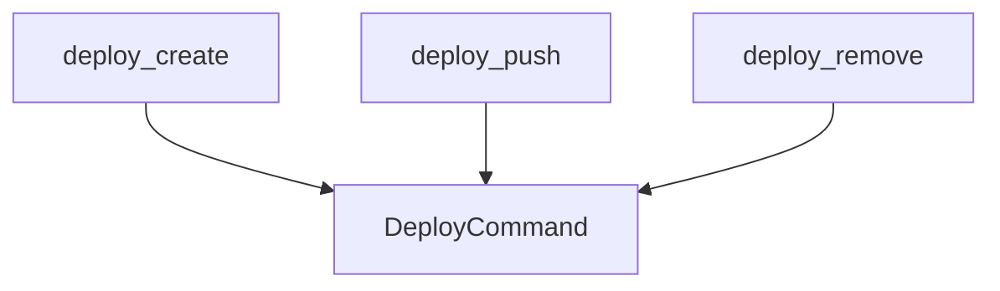

# deployment_operations Module Documentation

## Introduction

The `deployment_operations` module is a crucial part of the CrewAI CLI, providing the core command-line interface for managing the lifecycle of Crew deployments. It encapsulates functionalities for creating, deploying, and removing Crew instances, enabling users to interact with their deployed AI agents effectively.

## Purpose and Core Functionality

This module serves as the primary interface for CLI-driven deployment management. Its main responsibilities include:

*   **Creating Deployments**: Initializing new Crew deployments.
*   **Pushing Deployments**: Deploying existing Crew configurations to the CrewAI platform.
*   **Removing Deployments**: Deactivating and removing deployed Crew instances.

The module achieves these functionalities by interacting with a central `DeployCommand` utility, which handles the underlying business logic for each operation.

## Architecture and Component Relationships

The `deployment_operations` module consists of three main CLI functions, each responsible for a specific deployment action. These functions abstract the complexity of deployment management by leveraging a `DeployCommand` object.

<!-- DIAGRAM_JSON
{
    "direction": "TD",
    "nodes": [
        {"id": "deploy_create", "label": "deploy_create", "type": "component", "link": null},
        {"id": "deploy_push", "label": "deploy_push", "type": "component", "link": null},
        {"id": "deploy_remove", "label": "deploy_remove", "type": "component", "link": null},
        {"id": "deploy_command", "label": "DeployCommand", "type": "external", "link": "crew_deployment_management.md"}
    ],
    "edges": [
        {"source": "deploy_create", "target": "deploy_command"},
        {"source": "deploy_push", "target": "deploy_command"},
        {"source": "deploy_remove", "target": "deploy_command"}
    ],
    "groups": []
}
-->

### Core Components

*   **`deploy_create`**
    *   **Functionality**: Initiates the process of creating a new Crew deployment. It typically involves setting up the necessary configurations and resources for the Crew.
    *   **Usage**: Called via the CLI to start a new deployment creation workflow.

*   **`deploy_push`**
    *   **Functionality**: Handles the deployment of a Crew. This involves taking a defined Crew configuration and making it live on the CrewAI platform. It can target a specific deployment by its UUID.
    *   **Usage**: Used to update or initially push a Crew to the platform.

*   **`deploy_remove`**
    *   **Functionality**: Manages the removal or deactivation of an existing Crew deployment. It can target a specific deployment by its UUID.
    *   **Usage**: Executes commands to clean up and unregister deployed Crews.

## How it Fits into the Overall System

The `deployment_operations` module is a sub-module of [deployment_lifecycle_management](deployment_lifecycle_management.md), which in turn is part of the broader [crew_deployment_management](crew_deployment_management.md) within the [crewai_cli](crewai_cli.md) system. This hierarchical structure places `deployment_operations` at the execution layer for specific deployment actions, directly serving the CLI interface. It relies on the `DeployCommand` (likely defined in [crew_deployment_management](crew_deployment_management.md) or a closely related module) to perform the actual deployment logic, thus maintaining a clear separation of concerns between CLI command parsing and core deployment functionalities. Its integration ensures that users have robust command-line tools for managing their Crew deployments from creation to removal.
