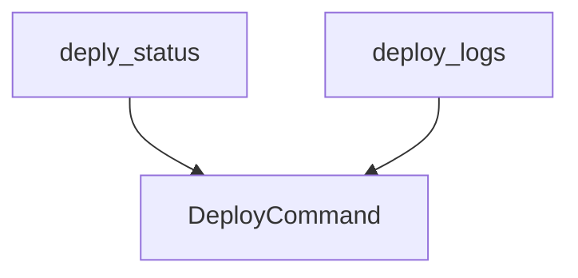

# `deployment_status_and_logs` Module Documentation

## Introduction

The `deployment_status_and_logs` module is a vital part of the CrewAI Command Line Interface (CLI), specifically within the deployment management functionalities. It provides users with direct tools to monitor the operational status and retrieve detailed logs of their deployed AI crews. This module ensures transparency and provides critical insights into the execution and health of deployed agents.

## Purpose and Core Functionality

This module focuses on two primary functions:
1.  **Retrieving Deployment Status**: Allows users to query the current status of a specific crew deployment using its unique identifier (UUID). This provides an immediate overview of whether a deployment is active, stopped, or in another state.
2.  **Accessing Deployment Logs**: Enables users to fetch the execution logs for a given crew deployment. These logs are crucial for debugging, performance monitoring, and understanding the step-by-step operations of the agents within a deployed crew.

The core components that facilitate these functionalities are:

*   **`deply_status(uuid: str | None) -> None`**: This function serves as the entry point for retrieving a deployment's status. It instantiates a `DeployCommand` object and delegates the status retrieval task to its `get_crew_status` method.
*   **`deploy_logs(uuid: str | None) -> None`**: This function is responsible for fetching the logs of a deployed crew. Similar to `deply_status`, it utilizes a `DeployCommand` instance to call the `get_crew_logs` method, which then retrieves and displays the relevant log information.

## Architecture and Component Relationships

The `deployment_status_and_logs` module acts as a thin wrapper over the `DeployCommand` class, which handles the actual logic for interacting with the deployment system. Both `deply_status` and `deploy_logs` instantiate `DeployCommand` to perform their respective operations.

This design promotes separation of concerns:
*   The `deployment_status_and_logs` module focuses on exposing CLI commands.
*   The `DeployCommand` (residing in the `crew_deployment_management` module) encapsulates the business logic for deployment interactions.

<!-- DIAGRAM_JSON
{
    "direction": "TD",
    "nodes": [
        {"id": "deply_status", "label": "deply_status", "type": "component", "link": null},
        {"id": "deploy_logs", "label": "deploy_logs", "type": "component", "link": null},
        {"id": "deploy_command", "label": "DeployCommand", "type": "external", "link": "crew_deployment_management.md"}
    ],
    "edges": [
        {"source": "deply_status", "target": "deploy_command"},
        {"source": "deploy_logs", "target": "deploy_command"}
    ],
    "groups": []
}
-->

## How the Module Fits into the Overall System

The `deployment_status_and_logs` module is an integral part of the `crewai_cli` module, specifically nested under `crew_deployment_management` and `deployment_monitoring_and_query`.

*   **Part of `crewai_cli`**: It extends the command-line interface, offering essential utilities for managing deployed crews.
*   **Dependency on `crew_deployment_management`**: It relies heavily on the `DeployCommand` class, which is a core component within the [crew_deployment_management](crew_deployment_management.md) module. This dependency highlights its role as an interface to the broader deployment management system.
*   **Enhances User Experience**: By providing direct CLI access to deployment status and logs, it empowers developers and operators to effectively monitor and troubleshoot their AI applications.

This module completes the deployment lifecycle management by enabling real-time feedback and diagnostic capabilities for deployed CrewAI agents.
