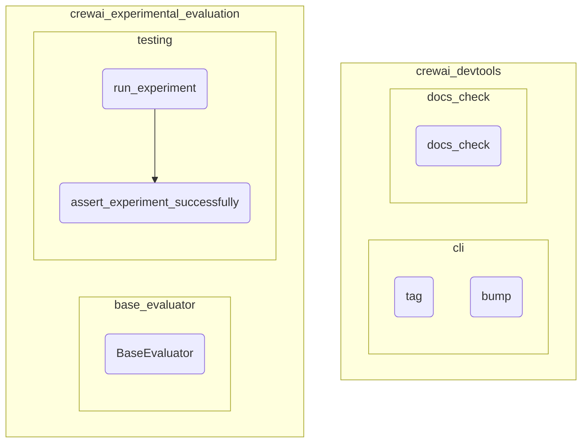

# development_tools
This module provides a suite of development utilities, including CLI tools for version management and documentation checks, alongside experimental components for evaluating CrewAI agents and tasks.

<!-- DIAGRAM_JSON
{
  "nodes": [
    {"id": "tag", "label": "tag"},
    {"id": "bump", "label": "bump"},
    {"id": "docs_check", "label": "docs_check"},
    {"id": "BaseEvaluator", "label": "BaseEvaluator"},
    {"id": "run_experiment", "label": "run_experiment"},
    {"id": "assert_experiment_successfully", "label": "assert_experiment_successfully"}
  ],
  "edges": [
    {"source": "run_experiment", "target": "assert_experiment_successfully", "label": "uses"}
  ],
  "groups": [
    {"id": "crewai_devtools", "label": "crewai_devtools",
      "groups": [
        {"id": "cli", "label": "cli", "nodes": ["tag", "bump"]},
        {"id": "docs_check_group", "label": "docs_check", "nodes": ["docs_check"]}
      ]
    },
    {"id": "crewai_experimental_evaluation", "label": "crewai.experimental.evaluation",
      "groups": [
        {"id": "base_evaluator_group", "label": "base_evaluator", "nodes": ["BaseEvaluator"]},
        {"id": "testing_group", "label": "testing", "nodes": ["run_experiment", "assert_experiment_successfully"]}
      ]
    }
  ]
}
-->
