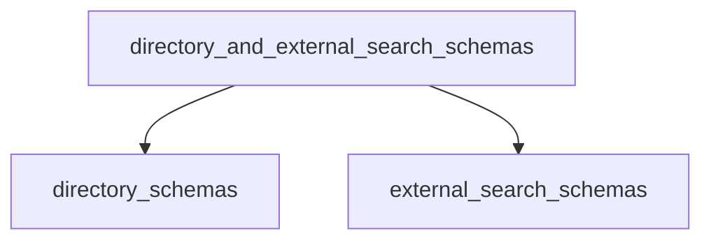

# directory_and_external_search_schemas

## Introduction and Purpose

The `directory_and_external_search_schemas` module defines the Pydantic schemas used to validate and structure inputs for tools that interact with local directories and external search platforms, such as GitHub. These schemas ensure that the input parameters for such tools are correctly formatted and contain all necessary information, thereby enhancing the reliability and usability of these data-accessing tools within the CrewAI framework. This module is a key component of the `crewai_tools_data_file_tools.schema_definitions` and plays a crucial role in enabling agents to effectively read and search various data sources.

## Architecture Overview

This module is logically divided into two primary sub-modules: `directory_schemas` and `external_search_schemas`. Each sub-module encapsulates a distinct set of functionalities, providing clear separation of concerns and maintainability.

- **[Directory Schemas](directory_schemas.md)**: This sub-module focuses on schemas related to operations within local file systems, specifically for reading and searching directories.
- **[External Search Schemas](external_search_schemas.md)**: This sub-module is dedicated to schemas that facilitate interactions with external search services, such as performing searches on GitHub repositories.

The relationship between these sub-modules and the main `directory_and_external_search_schemas` module is illustrated in the diagram below.

<!-- DIAGRAM_JSON
{
    "direction": "TD",
    "nodes": [
        {"id": "directory_and_external_search_schemas", "label": "Directory and External Search Schemas", "type": "module"},
        {"id": "directory_schemas", "label": "Directory Schemas", "type": "module", "link": "directory_schemas.md"},
        {"id": "external_search_schemas", "label": "External Search Schemas", "type": "module", "link": "external_search_schemas.md"}
    ],
    "edges": [
        {"source": "directory_and_external_search_schemas", "target": "directory_schemas"},
        {"source": "directory_and_external_search_schemas", "target": "external_search_schemas"}
    ],
    "groups": []
}
-->

## Sub-modules

### Directory Schemas

The `directory_schemas` sub-module defines the necessary input schemas for tools designed to interact with the local file system. This includes schemas for reading the content of a specified directory and searching for specific files or patterns within a directory.

*   **[Documentation for Directory Schemas](directory_schemas.md)**

### External Search Schemas

The `external_search_schemas` sub-module provides schemas for tools that perform searches on external platforms. Currently, this includes schemas for searching GitHub repositories, allowing for structured queries based on repository name and content types.

*   **[Documentation for External Search Schemas](external_search_schemas.md)**
