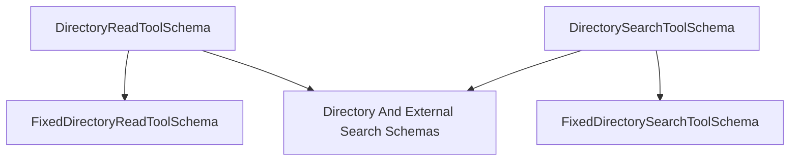

# directory_schemas

The `directory_schemas` module defines the input schemas for tools that interact with the file system, specifically for reading and searching directories. These schemas ensure that directory-related tools receive valid and structured input, facilitating robust and predictable operations.

## Architecture and Component Relationships

This module contains the fundamental Pydantic models used by the `DirectoryReadTool` and `DirectorySearchTool`. It resides within the `crewai_tools_data_file_tools` ecosystem, specifically under `schema_definitions` and `directory_and_external_search_schemas`, making it a specialized part of the broader schema definitions for data file tools.

<!-- DIAGRAM_JSON
{
    "direction": "TD",
    "nodes": [
        {"id": "directory_read_tool_schema", "label": "DirectoryReadToolSchema", "type": "component", "link": null},
        {"id": "directory_search_tool_schema", "label": "DirectorySearchToolSchema", "type": "component", "link": null},
        {"id": "fixed_directory_read_tool_schema", "label": "FixedDirectoryReadToolSchema", "type": "external", "link": "directory_and_external_search_schemas.md"},
        {"id": "fixed_directory_search_tool_schema", "label": "FixedDirectorySearchToolSchema", "type": "external", "link": "directory_and_external_search_schemas.md"},
        {"id": "directory_and_external_search_schemas", "label": "Directory And External Search Schemas", "type": "external", "link": "directory_and_external_search_schemas.md"}
    ],
    "edges": [
        {"source": "directory_read_tool_schema", "target": "fixed_directory_read_tool_schema"},
        {"source": "directory_search_tool_schema", "target": "fixed_directory_search_tool_schema"},
        {"source": "directory_read_tool_schema", "target": "directory_and_external_search_schemas"},
        {"source": "directory_search_tool_schema", "target": "directory_and_external_search_schemas"}
    ],
    "groups": []
}
-->



### Core Components

#### DirectoryReadToolSchema

```python
class DirectoryReadToolSchema(FixedDirectoryReadToolSchema):
    """Input for DirectoryReadTool."""

    directory: str = Field(..., description="Mandatory directory to list content")
```

This Pydantic schema defines the expected input for a tool designed to read the contents of a directory. It inherits from `FixedDirectoryReadToolSchema` (defined in [directory_and_external_search_schemas.md](directory_and_external_search_schemas.md)), ensuring a consistent base structure for directory-reading operations. The `directory` field is mandatory and specifies the path of the directory to be read.

#### DirectorySearchToolSchema

```python
class DirectorySearchToolSchema(FixedDirectorySearchToolSchema):
    """Input for DirectorySearchTool."""

    directory: str = Field(..., description="Mandatory directory you want to search")
```

This Pydantic schema specifies the required input for a tool that performs searches within a directory. Inheriting from `FixedDirectorySearchToolSchema` (defined in [directory_and_external_search_schemas.md](directory_and_external_search_schemas.md)), it provides a standardized format for directory search inputs. The `directory` field is mandatory, indicating the target directory for the search operation.
