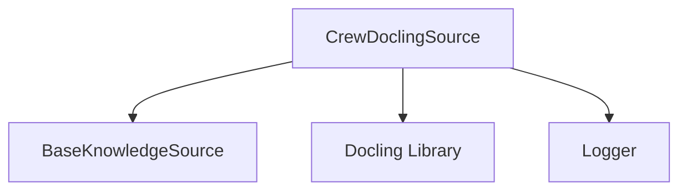

# Module: `docling_integration`

## Introduction

The `docling_integration` module provides the `CrewDoclingSource` class, a specialized knowledge source for the CrewAI framework. This module facilitates the ingestion and processing of various document formats (PDF, DOCX, TXT, XLSX, Images, HTML, PPTX, Markdown, AsciiDoc) by leveraging the `docling` library. It converts these documents into a standardized markdown or JSON format, which can then be chunked and utilized as knowledge by AI agents.

## Comprehensive Documentation

### Purpose and Core Functionality

The primary purpose of the `docling_integration` module is to bridge the gap between diverse document types and the CrewAI knowledge base. It encapsulates the complexities of document parsing and conversion, allowing agents to consume information from a wide array of file formats seamlessly.

The `CrewDoclingSource` component offers the following core functionalities:

*   **Multi-format Document Ingestion**: Supports a broad range of input formats including PDF, DOCX, TXT, XLSX, Images, HTML, PPTX, Markdown, and AsciiDoc, without requiring additional dependencies for each format beyond the `docling` package itself.
*   **Content Conversion**: Utilizes the `docling.DocumentConverter` to transform raw document content into `DoclingDocument` objects, which are an intermediate representation suitable for further processing.
*   **Hierarchical Chunking**: Employs `docling.HierarchicalChunker` to break down converted documents into manageable and semantically coherent chunks. This is crucial for efficient information retrieval and context management within AI applications.
*   **URL and Local File Path Validation**: Includes robust validation logic for both local file paths and remote URLs, ensuring that only accessible and valid sources are processed.
*   **Asynchronous Content Addition**: Provides an asynchronous method (`aadd`) for adding document content, enabling non-blocking I/O operations and improving performance in applications that handle large volumes of documents.

### Architecture and Component Relationships

The `docling_integration` module is centered around the `CrewDoclingSource` class. This class inherits from `BaseKnowledgeSource`, establishing it as a fundamental component within the [crewai_knowledge_sources](crewai_knowledge_sources.md) system. It directly interacts with the external `docling` library for its core document conversion and chunking capabilities. Logging within the module is handled by the `Logger` utility from the [crewai_utilities](crewai_utilities.md) module.

<!-- DIAGRAM_JSON
{
    "direction": "TD",
    "nodes": [
        {"id": "crew_docling_source", "label": "CrewDoclingSource", "type": "component", "link": null},
        {"id": "base_knowledge_source", "label": "BaseKnowledgeSource", "type": "external", "link": "crewai_knowledge_sources.md"},
        {"id": "docling_library", "label": "Docling Library", "type": "external", "link": null},
        {"id": "logger", "label": "Logger", "type": "external", "link": "crewai_utilities.md"}
    ],
    "edges": [
        {"source": "crew_docling_source", "target": "base_knowledge_source"},
        {"source": "crew_docling_source", "target": "docling_library"},
        {"source": "crew_docling_source", "target": "logger"}
    ],
    "groups": []
}
-->

### How the Module Fits into the Overall System

The `docling_integration` module plays a vital role in the CrewAI ecosystem by providing a versatile and robust mechanism for knowledge acquisition from various document formats. It serves as an essential building block for agents that need to process and understand information embedded in documents, whether they are local files or web resources.

By abstracting the complexities of document parsing and chunking, `CrewDoclingSource` allows developers to focus on designing intelligent agents without needing to implement intricate document handling logic. It seamlessly integrates into the broader [crewai_knowledge_sources](crewai_knowledge_sources.md) framework, making it straightforward to incorporate document-based knowledge alongside other forms of information. This enables the creation of more knowledgeable and capable AI agents that can draw insights from a rich variety of data sources.
