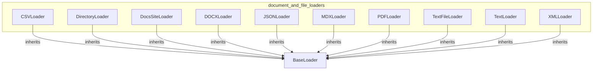

# document_and_file_loaders
This module provides a collection of specialized loaders for various document and file formats, enabling structured data extraction for RAG applications.

<!-- DIAGRAM_JSON
{
  "nodes": [
    {"id": "CSVLoader", "label": "CSVLoader"},
    {"id": "DirectoryLoader", "label": "DirectoryLoader"},
    {"id": "DocsSiteLoader", "label": "DocsSiteLoader"},
    {"id": "DOCXLoader", "label": "DOCXLoader"},
    {"id": "JSONLoader", "label": "JSONLoader"},
    {"id": "MDXLoader", "label": "MDXLoader"},
    {"id": "PDFLoader", "label": "PDFLoader"},
    {"id": "TextFileLoader", "label": "TextFileLoader"},
    {"id": "TextLoader", "label": "TextLoader"},
    {"id": "XMLLoader", "label": "XMLLoader"},
    {"id": "BaseLoader", "label": "BaseLoader", "type": "abstract"}
  ],
  "edges": [
    {"source": "CSVLoader", "target": "BaseLoader", "type": "inheritance"},
    {"source": "DirectoryLoader", "target": "BaseLoader", "type": "inheritance"},
    {"source": "DocsSiteLoader", "target": "BaseLoader", "type": "inheritance"},
    {"source": "DOCXLoader", "target": "BaseLoader", "type": "inheritance"},
    {"source": "JSONLoader", "target": "BaseLoader", "type": "inheritance"},
    {"source": "MDXLoader", "target": "BaseLoader", "type": "inheritance"},
    {"source": "PDFLoader", "target": "BaseLoader", "type": "inheritance"},
    {"source": "TextFileLoader", "target": "BaseLoader", "type": "inheritance"},
    {"source": "TextLoader", "target": "BaseLoader", "type": "inheritance"},
    {"source": "XMLLoader", "target": "BaseLoader", "type": "inheritance"}
  ],
  "groups": [
    {
      "id": "document_and_file_loaders",
      "label": "document_and_file_loaders",
      "nodes": [
        "CSVLoader",
        "DirectoryLoader",
        "DocsSiteLoader",
        "DOCXLoader",
        "JSONLoader",
        "MDXLoader",
        "PDFLoader",
        "TextFileLoader",
        "TextLoader",
        "XMLLoader"
      ]
    }
  ]
}
-->
