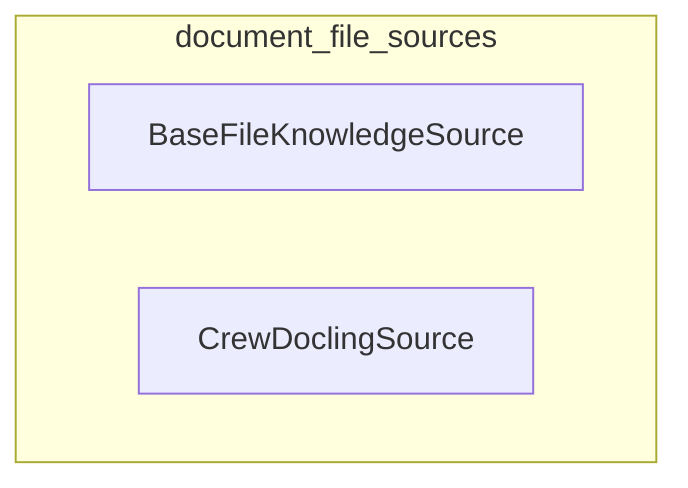

# document_file_sources
This module defines components for managing file-based knowledge sources, offering an abstract base class for file handling and a concrete implementation leveraging the Docling library for diverse document formats.

<!-- DIAGRAM_JSON
{
  "nodes": [
    {"id": "BFS", "label": "BaseFileKnowledgeSource"},
    {"id": "CDS", "label": "CrewDoclingSource"}
  ],
  "edges": [],
  "groups": [
    {"id": "document_file_sources", "label": "document_file_sources", "nodes": ["BFS", "CDS"]}
  ]
}
-->
