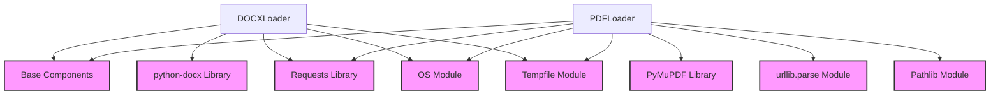

# `document_loaders`

## Introduction
The `document_loaders` module is a crucial part of the RAG (Retrieval Augmented Generation) system within `crewai-tools`, specifically designed for loading content from various document formats. It provides specialized loaders for common document types like DOCX and PDF, enabling the system to ingest structured and unstructured text from these files for further processing, such as chunking and embedding.

This module primarily focuses on robustly reading content from both local files and URLs, handling potential errors during download or parsing, and extracting relevant text and metadata.

## Architecture and Component Relationships

The `document_loaders` module currently includes dedicated loaders for DOCX and PDF files. Both loaders extend a `BaseLoader` class, ensuring a consistent interface for document ingestion across the RAG system.

### Core Components

*   [`DOCXLoader`](#docxloader): Handles loading and parsing of Microsoft Word (.docx) files.
*   [`PDFLoader`](#pdfloader): Handles loading and parsing of PDF (.pdf) files.

### How it Fits into the Overall System

The `document_loaders` module is a sub-module of [`file_loaders`](file_loaders.md), which in turn is part of [`data_loaders`](data_loaders.md) within the broader [`crewai_tools_rag_loaders_and_chunkers`](crewai_tools_rag_loaders_and_chunkers.md) system. Its output, `LoaderResult` objects containing extracted content and metadata, is then passed to subsequent stages of the RAG pipeline, such as chunking and embedding, which prepare the data for retrieval.

This module acts as the initial data ingestion layer for specific document types, providing the raw text content required by the RAG system to build a comprehensive knowledge base.

<!-- DIAGRAM_JSON
{
    "direction": "TD",
    "nodes": [
        {"id": "docx_loader", "label": "DOCXLoader", "type": "component", "link": null},
        {"id": "pdf_loader", "label": "PDFLoader", "type": "component", "link": null},
        {"id": "base_components", "label": "Base Components", "type": "external", "link": "base_components.md"},
        {"id": "python_docx_lib", "label": "python-docx Library", "type": "external", "link": null},
        {"id": "pymupdf_lib", "label": "PyMuPDF Library", "type": "external", "link": null},
        {"id": "requests_lib", "label": "Requests Library", "type": "external", "link": null},
        {"id": "os_module", "label": "OS Module", "type": "external", "link": null},
        {"id": "tempfile_module", "label": "Tempfile Module", "type": "external", "link": null},
        {"id": "urllib_parse_module", "label": "urllib.parse Module", "type": "external", "link": null},
        {"id": "pathlib_module", "label": "Pathlib Module", "type": "external", "link": null}
    ],
    "edges": [
        {"source": "docx_loader", "target": "base_components"},
        {"source": "docx_loader", "target": "python_docx_lib"},
        {"source": "docx_loader", "target": "requests_lib"},
        {"source": "docx_loader", "target": "os_module"},
        {"source": "docx_loader", "target": "tempfile_module"},
        {"source": "pdf_loader", "target": "base_components"},
        {"source": "pdf_loader", "target": "pymupdf_lib"},
        {"source": "pdf_loader", "target": "requests_lib"},
        {"source": "pdf_loader", "target": "os_module"},
        {"source": "pdf_loader", "target": "tempfile_module"},
        {"source": "pdf_loader", "target": "urllib_parse_module"},
        {"source": "pdf_loader", "target": "pathlib_module"}
    ],
    "groups": []
}
-->

## `DOCXLoader`
`DOCXLoader` is responsible for loading content from `.docx` files. It can handle both local file paths and URLs. When given a URL, it first downloads the DOCX file to a temporary location before processing.

### Functionality
*   **`load(self, source_content: SourceContent, **kwargs: Any) -> LoaderResult`**: The main method to load content.
    *   It checks if the `source_content` is a URL or a local file path.
    *   If a URL, it calls `_download_from_url` to fetch the file.
    *   It then calls `_load_from_file` to parse the DOCX document using the `python-docx` library.
    *   Extracts all paragraph text and combines them into a single content string.
    *   Generates metadata including the document format, number of paragraphs, and tables.
    *   Returns a `LoaderResult` object.
*   **`_download_from_url(url: str, kwargs: dict[str, Any]) -> str`**: A static method that downloads a DOCX file from the given URL.
    *   Uses `requests` to fetch the content with appropriate headers.
    *   Saves the downloaded content to a temporary file and returns its path.
    *   Raises `ValueError` on download failure.
*   **`_load_from_file(self, file_path: str, source_ref: str, DocxDocument: Any) -> LoaderResult`**: Loads the DOCX file from a given path.
    *   Initializes a `DocxDocument` object from the file.
    *   Iterates through paragraphs to extract text.
    *   Constructs metadata.
    *   Returns `LoaderResult`.
    *   Raises `ValueError` on parsing failure.

### Dependencies
*   **`BaseLoader`**: Inherited from `base_components` module, providing a standard interface.
*   **`SourceContent`, `LoaderResult`**: Data structures from `base_components` module.
*   **`python-docx`**: An external library required for parsing DOCX files.
*   **`requests`**: For downloading files from URLs.
*   **`os`, `tempfile`**: Python built-in modules for file system operations and temporary file creation.

## `PDFLoader`
`PDFLoader` is designed to load and extract text from PDF documents, supporting both local files and URLs.

### Functionality
*   **`load(self, source: SourceContent, **kwargs: Any) -> LoaderResult`**: The main method to load content from a PDF source.
    *   Checks if the source is a URL using `_is_url`.
    *   If a URL, it downloads the PDF using `_download_from_url`.
    *   Uses the `pymupdf` library to open and parse the PDF document.
    *   Iterates through each page, extracts text, and appends it to a list.
    *   Generates metadata including the source, file name, file type, and number of pages.
    *   Returns a `LoaderResult` object with the concatenated text content.
    *   Raises `FileNotFoundError` if a local file is not found, `ImportError` if `pymupdf` is not installed, or `ValueError` for other reading/downloading errors.
*   **`_is_url(path: str) -> bool`**: A static method to determine if a given path is a URL.
    *   Uses `urlparse` to check the scheme of the path.
*   **`_download_from_url(url: str, kwargs: dict[str, Any]) -> str`**: A static method to download a PDF from a URL.
    *   Similar to `DOCXLoader`, it uses `requests` with specific headers and saves to a temporary file.

### Dependencies
*   **`BaseLoader`**: Inherited from `base_components` module, providing a standard interface.
*   **`SourceContent`, `LoaderResult`**: Data structures from `base_components` module.
*   **`pymupdf`**: An external library essential for PDF parsing.
*   **`requests`**: For downloading PDF files from URLs.
*   **`os`, `tempfile`**: Python built-in modules for file system operations and temporary file handling.
*   **`urllib.parse`**: For parsing URLs.
*   **`pathlib`**: For path manipulations, specifically extracting the file name from a URL or file path.
