# document_search_tools Module Documentation

## Introduction
The `document_search_tools` module provides a suite of specialized RAG (Retrieval Augmented Generation) tools designed for semantic searching within various document types, including CSV, DOCX, JSON, MDX, PDF, TXT, and XML files. Each tool allows agents to query content within these specific file formats, leveraging underlying RAG capabilities to retrieve relevant information.

## Architecture and Component Relationships

This module primarily consists of several tool classes, each tailored to a specific document type. All these tools inherit from the `RagTool` base class, which provides the core RAG functionality. They extend this base functionality by handling document-specific loading and processing before performing semantic searches.

### Components

*   `CSVSearchTool`: Tool for semantic search within CSV files.
*   `DOCXSearchTool`: Tool for semantic search within DOCX files.
*   `JSONSearchTool`: Tool for semantic search within JSON files.
*   `MDXSearchTool`: Tool for semantic search within MDX files.
*   `PDFSearchTool`: Tool for semantic search within PDF files.
*   `TXTSearchTool`: Tool for semantic search within TXT files.
*   `XMLSearchTool`: Tool for semantic search within XML files.

Each tool can be initialized with a specific document path, allowing it to pre-configure itself for searching that particular file. Alternatively, the document path can be provided during the `_run` method execution.

<!-- DIAGRAM_JSON
{
    "direction": "TD",
    "nodes": [
        {"id": "csv_search_tool", "label": "CSVSearchTool", "type": "component", "link": null},
        {"id": "docx_search_tool", "label": "DOCXSearchTool", "type": "component", "link": null},
        {"id": "json_search_tool", "label": "JSONSearchTool", "type": "component", "link": null},
        {"id": "mdx_search_tool", "label": "MDXSearchTool", "type": "component", "link": null},
        {"id": "pdf_search_tool", "label": "PDFSearchTool", "type": "component", "link": null},
        {"id": "txt_search_tool", "label": "TXTSearchTool", "type": "component", "link": null},
        {"id": "xml_search_tool", "label": "XMLSearchTool", "type": "component", "link": null},
        {"id": "rag_tool", "label": "RagTool", "type": "external", "link": "crewai_tool_base.md"},
        {"id": "schema_definitions", "label": "Schema Definitions", "type": "external", "link": "schema_definitions.md"},
        {"id": "data_type_enum", "label": "DataType Enum", "type": "external", "link": "crewai_tools_rag_loaders_and_chunkers.md"}
    ],
    "edges": [
        {"source": "csv_search_tool", "target": "rag_tool"},
        {"source": "docx_search_tool", "target": "rag_tool"},
        {"source": "json_search_tool", "target": "rag_tool"},
        {"source": "mdx_search_tool", "target": "rag_tool"},
        {"source": "pdf_search_tool", "target": "rag_tool"},
        {"source": "txt_search_tool", "target": "rag_tool"},
        {"source": "xml_search_tool", "target": "rag_tool"},
        {"source": "csv_search_tool", "target": "schema_definitions"},
        {"source": "docx_search_tool", "target": "schema_definitions"},
        {"source": "json_search_tool", "target": "schema_definitions"},
        {"source": "mdx_search_tool", "target": "schema_definitions"},
        {"source": "pdf_search_tool", "target": "schema_definitions"},
        {"source": "txt_search_tool", "target": "schema_definitions"},
        {"source": "xml_search_tool", "target": "schema_definitions"},
        {"source": "csv_search_tool", "target": "data_type_enum"},
        {"source": "docx_search_tool", "target": "data_type_enum"},
        {"source": "mdx_search_tool", "target": "data_type_enum"},
        {"source": "pdf_search_tool", "target": "data_type_enum"},
        {"source": "txt_search_tool", "target": "data_type_enum"},
        {"source": "xml_search_tool", "target": "data_type_enum"}
    ],
    "groups": []
}
-->

```mermaid
graph TD
    csv_search_tool[CSVSearchTool]
    docx_search_tool[DOCXSearchTool]
    json_search_tool[JSONSearchTool]
    mdx_search_tool[MDXSearchTool]
    pdf_search_tool[PDFSearchTool]
    txt_search_tool[TXTSearchTool]
    xml_search_tool[XMLSearchTool]
    rag_tool[RagTool]
    schema_definitions[Schema Definitions]
    data_type_enum[DataType Enum]

    csv_search_tool --> rag_tool
    docx_search_tool --> rag_tool
    json_search_tool --> rag_tool
    mdx_search_tool --> rag_tool
    pdf_search_tool --> rag_tool
    txt_search_tool --> rag_tool
    xml_search_tool --> rag_tool

    csv_search_tool --> schema_definitions
    docx_search_tool --> schema_definitions
    json_search_tool --> schema_definitions
    mdx_search_tool --> schema_definitions
    pdf_search_tool --> schema_definitions
    txt_search_tool --> schema_definitions
    xml_search_tool --> schema_definitions

    csv_search_tool --> data_type_enum
    docx_search_tool --> data_type_enum
    mdx_search_tool --> data_type_enum
    pdf_search_tool --> data_type_enum
    txt_search_tool --> data_type_enum
    xml_search_tool --> data_type_enum
```

## Module Integration

The `document_search_tools` module is a sub-module of `crewai_tools_data_file_tools.file_content_search_tools.file_type_search_tools`. It integrates into the larger CrewAI ecosystem by providing specific RAG capabilities for various document types.

It leverages the generic RAG functionality provided by the [crewai_tool_base module](crewai_tool_base.md) through the `RagTool` class. The module also depends on the [crewai_tools_rag_loaders_and_chunkers module](crewai_tools_rag_loaders_and_chunkers.md) for handling different `DataType` enums during document addition. Input and output schemas for these tools are defined within the [schema_definitions module](schema_definitions.md), ensuring consistent data validation and structure.