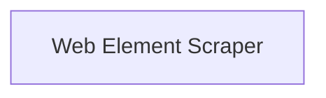

# Element Scraping Module

The `element_scraping` module is a crucial part of the `crewai-tools` web scraping capabilities. It provides specialized tools for precisely extracting content from specific HTML elements on a webpage using CSS selectors.

## Architecture Overview

This module focuses on granular web content extraction. Its primary component, `ScrapeElementFromWebsiteTool`, leverages the `ScrapeElementFromWebsiteToolSchema` to define the necessary input parameters, such as the target URL and the CSS selector for the desired element. This design ensures robust and targeted scraping, making it ideal for extracting particular data points from complex web pages.

<!-- DIAGRAM_JSON
{
    "direction": "TD",
    "nodes": [
        {"id": "web_element_scraper", "label": "Web Element Scraper", "type": "module", "link": "web_element_scraper.md"}
    ],
    "edges": [],
    "groups": []
}
-->

## High-Level Functionality

The `element_scraping` module offers the following key functionality through its sub-module:

*   **[Web Element Scraper](web_element_scraper.md)**: Provides the core logic and schema for scraping content from specified HTML elements on a given website.