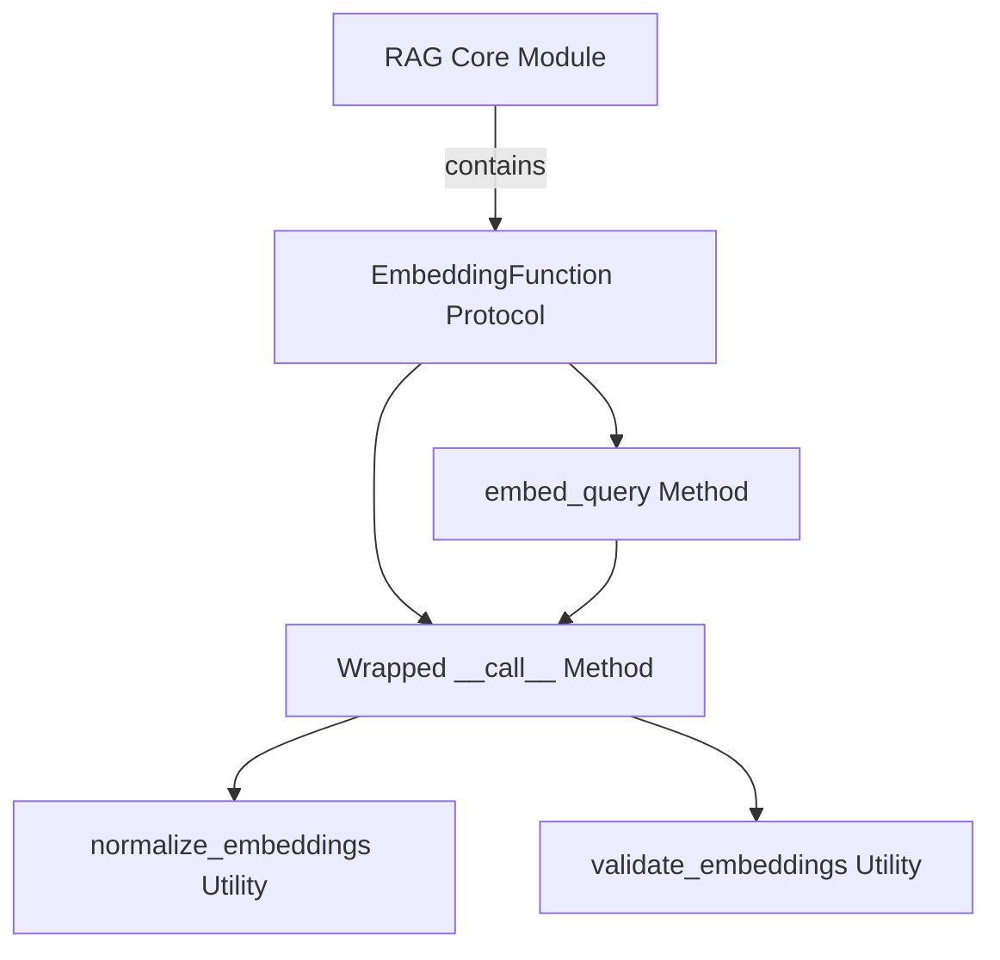

# `embedding_handling` Module Documentation

## Introduction

The `embedding_handling` module is a crucial component within the CrewAI RAG (Retrieval Augmented Generation) system, primarily responsible for defining a standardized protocol for converting various input data types (such as documents or images) into vector embeddings. It ensures that all embedding functions adhere to a common interface and that the generated embeddings are consistently normalized and validated across the system.

## Purpose and Core Functionality

This module's core purpose is to abstract the complexities of embedding generation by providing a `Protocol` for embedding functions. This allows different embedding implementations to be plugged into the RAG system while guaranteeing uniform output quality through automatic normalization and validation. Key functionalities include:

*   **Standardized Embedding Interface**: Defines `EmbeddingFunction` as a `Protocol` that any embedding provider must implement.
*   **Automatic Embedding Processing**: Through `__init_subclass__`, it automatically wraps the `__call__` method of any implementing class to ensure embeddings are never `None`, and are always normalized and validated.
*   **Query Embedding**: Provides a dedicated `embed_query` method, which by default uses the main embedding logic, offering flexibility for specific query embedding optimizations if needed.

## Architecture and Component Relationships

The `embedding_handling` module centers around the `EmbeddingFunction` protocol. This protocol dictates the structure for any class that wishes to provide embedding capabilities to the CrewAI system. The architecture ensures that any concrete implementation of an `EmbeddingFunction` automatically gains error handling, normalization, and validation capabilities without explicit boilerplate code.

<!-- DIAGRAM_JSON
{
    "direction": "TD",
    "nodes": [
        {"id": "embedding_function_protocol", "label": "EmbeddingFunction Protocol", "type": "component", "link": null},
        {"id": "wrapped_call_method", "label": "Wrapped __call__ Method", "type": "component", "link": null},
        {"id": "embed_query_method", "label": "embed_query Method", "type": "component", "link": null},
        {"id": "normalize_embeddings_util", "label": "normalize_embeddings Utility", "type": "component", "link": null},
        {"id": "validate_embeddings_util", "label": "validate_embeddings Utility", "type": "component", "link": null},
        {"id": "rag_core_module", "label": "RAG Core Module", "type": "external", "link": "rag_core.md"}
    ],
    "edges": [
        {"source": "embedding_function_protocol", "target": "wrapped_call_method"},
        {"source": "embedding_function_protocol", "target": "embed_query_method"},
        {"source": "wrapped_call_method", "target": "normalize_embeddings_util"},
        {"source": "wrapped_call_method", "target": "validate_embeddings_util"},
        {"source": "embed_query_method", "target": "wrapped_call_method"}
    ],
    "groups": []
}
-->

### Core Components

#### `EmbeddingFunction` Protocol

`lib.crewai.src.crewai.rag.core.base_embeddings_callable.EmbeddingFunction`

This `Protocol` defines the interface for any class that provides embedding functionality. It mandates a `__call__` method for converting input data into `Embeddings`. Crucially, its `__init_subclass__` method automatically enhances any implementing class's `__call__` method to perform:

1.  **Non-Null Check**: Ensures the embedding function does not return `None`.
2.  **Normalization**: Applies `normalize_embeddings` to standardize the vector outputs.
3.  **Validation**: Applies `validate_embeddings` to ensure the embeddings conform to expected criteria.

It also provides an `embed_query` method, which can be optionally overridden for query-specific embedding logic, but by default, it leverages the main `__call__` method.

## How the Module Fits into the Overall System

The `embedding_handling` module is an integral part of the `crewai_rag_system`, specifically residing within the `rag_core` module. It acts as the foundational layer for all embedding-related operations in the RAG pipeline. By providing a robust and enforced protocol, it ensures that diverse embedding models or services can be seamlessly integrated, guaranteeing consistent and high-quality vector representations necessary for effective retrieval and generation processes. This module's standardization allows other RAG components, such as `collection_operations` or different `rag_factory` implementations, to rely on a predictable embedding output, simplifying their design and improving system reliability.

**Referenced Modules:**
*   [rag_core](rag_core.md)
