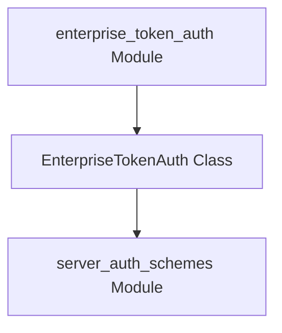

# enterprise_token_auth

## Introduction
The `enterprise_token_auth` module is a crucial component within the `crewai_agent_to_agent_communication` framework, specifically designed to handle enterprise-grade token authentication for server-side operations. It provides a robust mechanism for validating bearer tokens against an external enterprise verification endpoint, ensuring secure inter-agent communication within a CrewAI ecosystem.

## Module Purpose and Core Functionality
The primary purpose of the `enterprise_token_auth` module is to offer a specialized server authentication scheme for enterprise environments. Its core functionality is encapsulated within the `EnterpriseTokenAuth` class, which extends the `ServerAuthScheme` abstract base class.

The `EnterpriseTokenAuth` class is responsible for:
- **Enterprise Token Validation**: It is designed to validate incoming bearer tokens by interacting with a designated "PlusAPI enterprise verification endpoint." This allows for centralized and consistent authentication policies across an enterprise system.
- **Secure Communication**: By leveraging an external verification service, it enhances the security posture of agent-to-agent communication, ensuring that only authenticated and authorized agents can interact.

### `EnterpriseTokenAuth` Class
```python
class EnterpriseTokenAuth(ServerAuthScheme):
    """Enterprise token authentication.

    Validates tokens via the PlusAPI enterprise verification endpoint.
    """

    async def authenticate(self, token: str) -> AuthenticatedUser:
        """Authenticate using enterprise token verification.

        Args:
            token: The bearer token to authenticate.

        Raises:
            NotImplementedError
        """
        raise NotImplementedError
```
The `authenticate` method, when fully implemented, will contain the logic to send the provided token to the enterprise verification endpoint and process the response to determine the authenticity of the user. Currently, it serves as a placeholder, indicating that the specific integration logic needs to be developed.

## Architecture and Component Relationships

<!-- DIAGRAM_JSON
{
    "direction": "TD",
    "nodes": [
        {"id": "enterprise_token_auth_module", "label": "enterprise_token_auth Module", "type": "component", "link": null},
        {"id": "enterprise_token_auth_class", "label": "EnterpriseTokenAuth Class", "type": "component", "link": null},
        {"id": "server_auth_schemes", "label": "server_auth_schemes Module", "type": "external", "link": "server_auth_schemes.md"}
    ],
    "edges": [
        {"source": "enterprise_token_auth_module", "target": "enterprise_token_auth_class", "label": "contains"},
        {"source": "enterprise_token_auth_class", "target": "server_auth_schemes", "label": "inherits ServerAuthScheme from"}
    ],
    "groups": []
}
-->


The diagram above illustrates the internal structure and external dependencies of the `enterprise_token_auth` module. The module itself contains the `EnterpriseTokenAuth` class. This class is a specialized implementation of a server authentication scheme, inheriting its foundational structure and contracts from the `ServerAuthScheme` abstract class, which is defined within the `server_auth_schemes` module.

## System Integration
The `enterprise_token_auth` module plays a specific role within the broader [crewai_agent_to_agent_communication](crewai_agent_to_agent_communication.md) system. It is nested under [a2a_auth_schemes](a2a_auth_schemes.md) and more specifically under [server_auth_schemes](server_auth_schemes.md).

- **Part of Server Authentication Schemes**: This module contributes to the collection of server-side authentication methods available for agents, ensuring flexibility in deployment environments.
- **Enterprise Security Layer**: It provides a dedicated solution for organizations requiring integration with existing enterprise identity and access management systems for token validation.
- **Inter-Agent Communication Security**: By offering a robust authentication mechanism, it helps secure the interactions between different agents within a CrewAI application, particularly in enterprise contexts where stringent security policies are often in place.

This integration ensures that enterprise-specific authentication requirements can be met without altering the core agent communication protocols, making the CrewAI framework adaptable to various organizational security postures.
