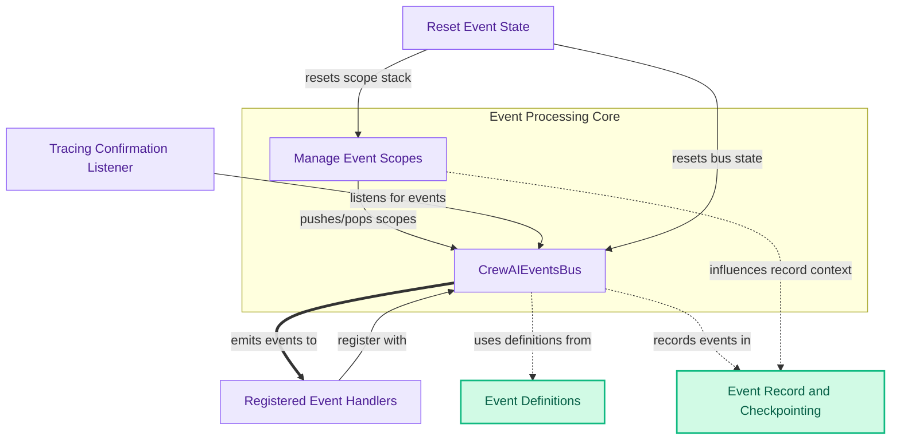

# Event Bus and Context

This module establishes a robust event-driven architecture using a singleton event bus for managing, dispatching, and handling both synchronous and asynchronous events with dependency resolution, along with utilities for event context management and system state resetting.

<!-- DIAGRAM_JSON
{
    "direction": "TD",
    "nodes": [
        {"id": "event_bus", "label": "CrewAIEventsBus", "type": "component", "link": null},
        {"id": "event_scope_manager", "label": "Manage Event Scopes", "type": "component", "link": null},
        {"id": "event_handlers", "label": "Registered Event Handlers", "type": "component", "link": null},
        {"id": "tracing_listener", "label": "Tracing Confirmation Listener", "type": "component", "link": null},
        {"id": "event_state_reset", "label": "Reset Event State", "type": "component", "link": null},
        {"id": "event_definitions", "label": "Event Definitions", "type": "external", "link": "event_definitions.md"},
        {"id": "event_recording", "label": "Event Record and Checkpointing", "type": "external", "link": "event_record_and_checkpointing.md"}
    ],
    "edges": [
        {"source": "event_bus", "target": "event_handlers", "label": "emits events to"},
        {"source": "event_handlers", "target": "event_bus", "label": "register with"},
        {"source": "event_scope_manager", "target": "event_bus", "label": "pushes/pops scopes"},
        {"source": "event_bus", "target": "event_definitions", "label": "uses definitions from"},
        {"source": "event_bus", "target": "event_recording", "label": "records events in"},
        {"source": "event_scope_manager", "target": "event_recording", "label": "influences record context"},
        {"source": "tracing_listener", "target": "event_bus", "label": "listens for events"},
        {"source": "event_state_reset", "target": "event_bus", "label": "resets bus state"},
        {"source": "event_state_reset", "target": "event_scope_manager", "label": "resets scope stack"}
    ],
    "groups": [
        {"id": "event_processing_core", "label": "Event Processing Core", "role": "analytical", "nodes": ["event_bus", "event_scope_manager"]}
    ]
}
-->
