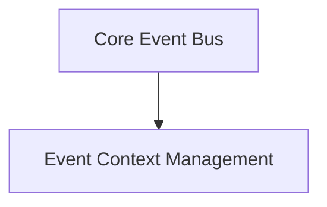

# Event Bus Management Module

## Introduction

The `event_bus_management` module is a critical component within the `crewai_event_system`, responsible for orchestrating the flow of events throughout the CrewAI framework. It provides a robust, singleton-based event bus that enables decoupled communication between various parts of the system. This module ensures that events are efficiently dispatched to both synchronous and asynchronous handlers, managing dependencies and execution contexts for reliable and performant event processing.

## Architecture Overview

The `event_bus_management` module is composed of two primary sub-modules:

1.  **Core Event Bus (`event_bus_core`)**: This sub-module houses the central `CrewAIEventsBus` singleton, which is the heart of event dispatching and handling.
2.  **Event Context Management (`event_context_management`)**: This sub-module provides utilities for managing event scopes, allowing for hierarchical tracking of events.

These sub-modules work in tandem to provide a comprehensive event handling mechanism. The `CrewAIEventsBus` orchestrates the event flow, while `event_context_management` ensures proper contextual tracking of events, especially important for understanding event causality and parent-child relationships.

<!-- DIAGRAM_JSON
{
    "direction": "TD",
    "nodes": [
        {"id": "event_bus_core", "label": "Core Event Bus", "type": "module", "link": "event_bus_core.md"},
        {"id": "event_context_management", "label": "Event Context Management", "type": "module", "link": "event_context_management.md"}
    ],
    "edges": [
        {"source": "event_bus_core", "target": "event_context_management", "label": "utilizes"}
    ],
    "groups": []
}
-->

## Sub-modules

### Core Event Bus

This sub-module, documented in [`event_bus_core.md`](event_bus_core.md), contains the `CrewAIEventsBus` class. It is responsible for the core functionality of the event system, including:

*   Registering and unregistering event handlers.
*   Emitting events to synchronous and asynchronous handlers.
*   Managing handler dependencies and execution order.
*   Providing a graceful shutdown mechanism for the event bus.

### Event Context Management

This sub-module, detailed in [`event_context_management.md`](event_context_management.md), provides the `event_scope` context manager. Its primary role is to:

*   Establish and manage hierarchical event scopes.
*   Track parent-child relationships between events, crucial for debugging and tracing event flows.