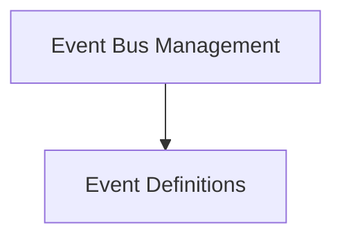

# Event Core Module Documentation

## Introduction

The `event_core` module is the backbone of the CrewAI event system, providing the fundamental structures and mechanisms for event definition, emission, and handling. It ensures a robust and scalable way for different components of the CrewAI framework to communicate and react to significant occurrences within the system.

## Architecture Overview

The `event_core` module is designed with a clear separation of concerns, dividing its functionality into defining the events themselves and managing the event bus. This allows for flexible event structures and an efficient, centralized event dispatching mechanism.

<!-- DIAGRAM_JSON
{
    "direction": "TD",
    "nodes": [
        {"id": "event_definitions", "label": "Event Definitions", "type": "module", "link": "event_definitions.md"},
        {"id": "event_bus_management", "label": "Event Bus Management", "type": "module", "link": "event_bus_management.md"}
    ],
    "edges": [
        {"source": "event_bus_management", "target": "event_definitions"}
    ],
    "groups": []
}
-->

## Sub-modules

### [Event Definitions](event_definitions.md)
This sub-module is responsible for defining the base class for all events (`BaseEvent`). It establishes a consistent structure for events, including timestamps, types, source information, and identifiers, which is crucial for tracing and logging throughout the CrewAI system.

### [Event Bus Management](event_bus_management.md)
This sub-module houses the `CrewAIEventsBus`, a singleton responsible for managing event registration, emission, and the lifecycle of event handlers. It supports both synchronous and asynchronous handlers, handles dependencies between them, and provides mechanisms for graceful shutdown. It also includes `event_scope` for managing event context during execution.