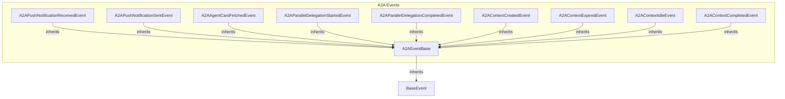

# event_definitions
This module defines various event classes for tracking activities within a CrewAI system, including a base event and specific events related to Agent-to-Agent (A2A) communication and context management.

<!-- DIAGRAM_JSON
{
    "nodes": [
        {
            "id": "BaseEvent",
            "label": "BaseEvent"
        },
        {
            "id": "A2AEventBase",
            "label": "A2AEventBase"
        },
        {
            "id": "A2APushNotificationReceivedEvent",
            "label": "A2APushNotificationReceivedEvent"
        },
        {
            "id": "A2APushNotificationSentEvent",
            "label": "A2APushNotificationSentEvent"
        },
        {
            "id": "A2AAgentCardFetchedEvent",
            "label": "A2AAgentCardFetchedEvent"
        },
        {
            "id": "A2AParallelDelegationStartedEvent",
            "label": "A2AParallelDelegationStartedEvent"
        },
        {
            "id": "A2AParallelDelegationCompletedEvent",
            "label": "A2AParallelDelegationCompletedEvent"
        },
        {
            "id": "A2AContextCreatedEvent",
            "label": "A2AContextCreatedEvent"
        },
        {
            "id": "A2AContextExpiredEvent",
            "label": "A2AContextExpiredEvent"
        },
        {
            "id": "A2AContextIdleEvent",
            "label": "A2AContextIdleEvent"
        },
        {
            "id": "A2AContextCompletedEvent",
            "label": "A2AContextCompletedEvent"
        }
    ],
    "edges": [
        {
            "source": "A2AEventBase",
            "target": "BaseEvent",
            "type": "inheritance"
        },
        {
            "source": "A2APushNotificationReceivedEvent",
            "target": "A2AEventBase",
            "type": "inheritance"
        },
        {
            "source": "A2APushNotificationSentEvent",
            "target": "A2AEventBase",
            "type": "inheritance"
        },
        {
            "source": "A2AAgentCardFetchedEvent",
            "target": "A2AEventBase",
            "type": "inheritance"
        },
        {
            "source": "A2AParallelDelegationStartedEvent",
            "target": "A2AEventBase",
            "type": "inheritance"
        },
        {
            "source": "A2AParallelDelegationCompletedEvent",
            "target": "A2AEventBase",
            "type": "inheritance"
        },
        {
            "source": "A2AContextCreatedEvent",
            "target": "A2AEventBase",
            "type": "inheritance"
        },
        {
            "source": "A2AContextExpiredEvent",
            "target": "A2AEventBase",
            "type": "inheritance"
        },
        {
            "source": "A2AContextIdleEvent",
            "target": "A2AEventBase",
            "type": "inheritance"
        },
        {
            "source": "A2AContextCompletedEvent",
            "target": "A2AEventBase",
            "type": "inheritance"
        }
    ],
    "groups": []
}
-->
