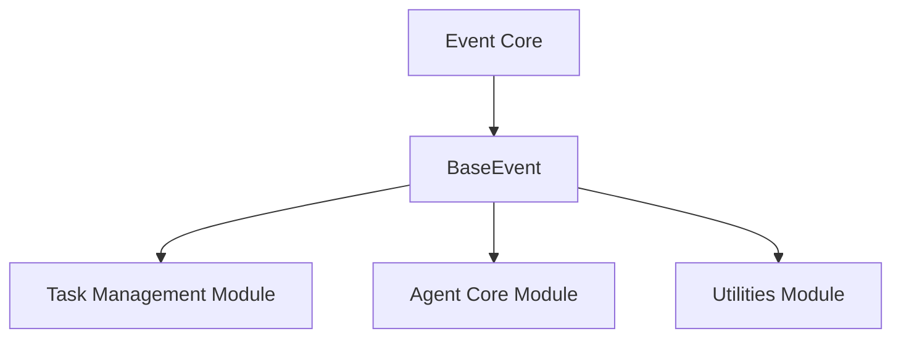

# Module: `event_definitions`

## Introduction
The `event_definitions` module serves as the foundational layer for event management within the CrewAI system. Its primary role is to define the `BaseEvent` class, which acts as a standardized blueprint for all events generated and processed across the framework. By establishing a consistent structure for event data, this module ensures uniformity in event logging, tracking, and inter-component communication.

## Architecture and Component Relationships

<!-- DIAGRAM_JSON
{
    "direction": "TD",
    "nodes": [
        {"id": "base_event", "label": "BaseEvent", "type": "component", "link": null},
        {"id": "event_core", "label": "Event Core", "type": "external", "link": "event_core.md"},
        {"id": "crewai_task_management", "label": "Task Management Module", "type": "external", "link": "crewai_task_management.md"},
        {"id": "crewai_agent_core", "label": "Agent Core Module", "type": "external", "link": "crewai_agent_core.md"},
        {"id": "crewai_utilities", "label": "Utilities Module", "type": "external", "link": "crewai_utilities.md"}
    ],
    "edges": [
        {"source": "base_event", "target": "crewai_task_management"},
        {"source": "base_event", "target": "crewai_agent_core"},
        {"source": "base_event", "target": "crewai_utilities"},
        {"source": "event_core", "target": "base_event"}
    ],
    "groups": []
}
-->

The `event_definitions` module, containing the `BaseEvent`, is a core component within the larger [event_core](event_core.md) module. The `BaseEvent` class itself has direct dependencies on the [crewai_task_management](crewai_task_management.md) and [crewai_agent_core](crewai_agent_core.md) modules to incorporate task and agent-specific contextual data into events. Additionally, it relies on the [crewai_utilities](crewai_utilities.md) module for serialization functionalities.

## Component Details

### `BaseEvent`
`lib.crewai.src.crewai.events.base_events.BaseEvent`

The `BaseEvent` class is the abstract base class for all events in the CrewAI system, ensuring a consistent event structure.

-   **Purpose**: To provide a standardized and extendable structure for all events, facilitating uniform handling, logging, and analysis across the CrewAI framework.
-   **Key Attributes**:
    -   `timestamp`: A `datetime` object representing the UTC time when the event was created.
    -   `type`: A string indicating the specific type of the event (e.g., "agent_started", "task_completed").
    -   `source_fingerprint`: An optional UUID string to identify the entity that originated the event.
    -   `source_type`: An optional string specifying the type of the source entity (e.g., "agent", "task", "crew").
    -   `fingerprint_metadata`: An optional dictionary for any additional metadata related to the source.
    -   `task_id`, `task_name`: Optional strings providing contextual information about the task associated with the event.
    -   `agent_id`, `agent_role`: Optional strings providing contextual information about the agent associated with the event.
    -   `event_id`: A unique UUID string for the event itself.
    -   `parent_event_id`, `previous_event_id`, `triggered_by_event_id`, `started_event_id`: Optional UUID strings for tracing event lineage and relationships.
    -   `emission_sequence`: An optional integer indicating the sequence of event emission.

-   **Core Methods**:
    -   `to_json(exclude: set[str] | None = None) -> Serializable`: Converts the event instance into a JSON-serializable dictionary. It allows specifying keys to exclude from the output.
    -   `_set_task_params(data: dict[str, Any]) -> None`: An internal method responsible for extracting task-related parameters from an input dictionary and populating the `task_id` and `task_name` attributes.
    -   `_set_agent_params(data: dict[str, Any]) -> None`: An internal method for extracting agent-related parameters from an input dictionary and populating the `agent_id` and `agent_role` attributes.

## How it Fits into the Overall System
The `event_definitions` module is a cornerstone of the CrewAI's event-driven architecture, positioned within the [crewai_event_system](crewai_event_system.md). It ensures that all events, regardless of their origin within the system (e.g., agent actions, task progress, memory operations), adhere to a common, well-defined structure. This consistency is vital for several aspects of the CrewAI framework:

-   **Unified Observability**: By standardizing event formats, the module enables consistent logging, monitoring, and debugging across all system components.
-   **Inter-Module Communication**: It provides a common language for various CrewAI modules to effectively communicate state changes and actions, fostering a decoupled and robust architecture.
-   **Traceability and Analysis**: The detailed attributes within `BaseEvent`, especially those related to event lineage (`parent_event_id`, `triggered_by_event_id`), facilitate comprehensive tracing of execution flows and in-depth analysis of system behavior.
-   **Extensibility**: `BaseEvent` serves as the fundamental base class for all specific event types throughout CrewAI. This allows developers to easily extend the event system with new custom events while inheriting essential functionalities and maintaining structural integrity.

In essence, `event_definitions` provides the essential grammar for the CrewAI system to articulate its internal state and activities, making it an indispensable part of the overall framework's robustness and maintainability.
