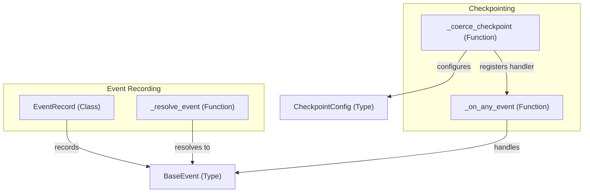

# event_record_and_checkpointing
Manages the recording of execution events and provides mechanisms for automatic state checkpointing based on these events.

<!-- DIAGRAM_JSON
{
  "nodes": [
    {"id": "EventRecord", "label": "EventRecord", "type": "class"},
    {"id": "_resolve_event", "label": "_resolve_event", "type": "function"},
    {"id": "_on_any_event", "label": "_on_any_event", "type": "function"},
    {"id": "_coerce_checkpoint", "label": "_coerce_checkpoint", "type": "function"},
    {"id": "BaseEvent", "label": "BaseEvent", "type": "type"},
    {"id": "CheckpointConfig", "label": "CheckpointConfig", "type": "type"}
  ],
  "edges": [
    {"source": "EventRecord", "target": "BaseEvent", "label": "records"},
    {"source": "_resolve_event", "target": "BaseEvent", "label": "resolves to"},
    {"source": "_on_any_event", "target": "BaseEvent", "label": "handles"},
    {"source": "_coerce_checkpoint", "target": "CheckpointConfig", "label": "configures"},
    {"source": "_coerce_checkpoint", "target": "_on_any_event", "label": "registers handler"}
  ],
  "groups": [
    {"id": "event_recording", "label": "Event Recording", "members": ["EventRecord", "_resolve_event"]},
    {"id": "checkpointing", "label": "Checkpointing", "members": ["_on_any_event", "_coerce_checkpoint"]}
  ]
}
-->
