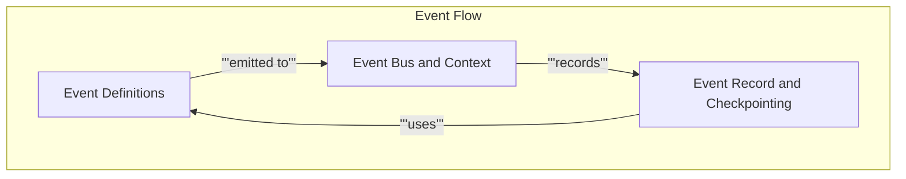

# Event System

This module provides the core event handling infrastructure for CrewAI, including a singleton event bus, event definitions, context management, and event recording for traceability and checkpointing.

<!-- DIAGRAM_JSON
{
    "direction": "TD",
    "nodes": [
        {"id": "event_bus_and_context", "label": "Event Bus and Context", "type": "module", "link": "event_bus_and_context.md"},
        {"id": "event_definitions", "label": "Event Definitions", "type": "module", "link": "event_definitions.md"},
        {"id": "event_record_and_checkpointing", "label": "Event Record and Checkpointing", "type": "module", "link": "event_record_and_checkpointing.md"}
    ],
    "edges": [
        {"source": "event_definitions", "target": "event_bus_and_context", "label": "emitted to"},
        {"source": "event_bus_and_context", "target": "event_record_and_checkpointing", "label": "records"},
        {"source": "event_record_and_checkpointing", "target": "event_definitions", "label": "uses"}
    ],
    "groups": [
        {"id": "event_flow", "label": "Event Flow", "role": "analytical", "nodes": ["event_bus_and_context", "event_definitions", "event_record_and_checkpointing"]}
    ]
}
-->

