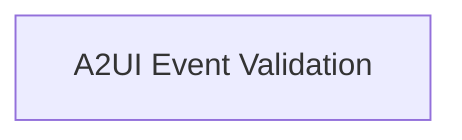

# `event_validators` Module Documentation

## Introduction

The `event_validators` module is a crucial component within the Agent-to-Agent (A2A) communication extensions for the Agent-to-UI (A2UI) interaction in CrewAI. Its primary purpose is to ensure the integrity and adherence to predefined schemas of events exchanged between A2UI clients and servers. By rigorously validating incoming event data, this module prevents malformed or unauthorized data from corrupting the system and maintains reliable communication.

## Architecture

The `event_validators` module is composed of a single sub-module: `a2ui_event_validation`. This sub-module encapsulates the logic for validating A2UI events against their respective schemas, handling different versions of the A2UI event specification.

<!-- DIAGRAM_JSON
{
    "direction": "TD",
    "nodes": [
        {"id": "a2ui_event_validation", "label": "A2UI Event Validation", "type": "module", "link": "a2ui_event_validation.md"}
    ],
    "edges": [],
    "groups": []
}
-->

## Sub-modules

### [A2UI Event Validation](a2ui_event_validation.md)
This sub-module contains the core functions responsible for parsing and validating A2UI client-to-server events. It supports different versions of the A2UI event schema, ensuring compatibility and data integrity across the system.