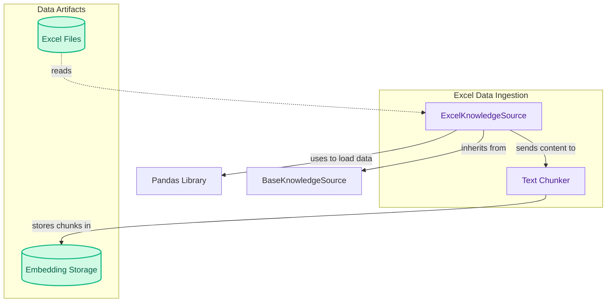

# Excel Data Sources

The `excel_data_sources` module offers `ExcelKnowledgeSource`, allowing agents to ingest, preprocess, and query data from Excel files. It converts multiple sheets to CSV, chunks the content, and prepares it for embedding-based retrieval.

<!-- DIAGRAM_JSON
{
    "direction": "TD",
    "nodes": [
        {
            "id": "excel_source",
            "label": "ExcelKnowledgeSource",
            "type": "component",
            "link": null
        },
        {
            "id": "excel_files",
            "label": "Excel Files",
            "type": "data",
            "link": null
        },
        {
            "id": "pandas_lib",
            "label": "Pandas Library",
            "type": "external",
            "link": null
        },
        {
            "id": "base_knowledge_source",
            "label": "BaseKnowledgeSource",
            "type": "external",
            "link": "knowledge_sources.md"
        },
        {
            "id": "text_chunker",
            "label": "Text Chunker",
            "type": "component",
            "link": null
        },
        {
            "id": "embedding_storage",
            "label": "Embedding Storage",
            "type": "data",
            "link": null
        }
    ],
    "edges": [
        {
            "source": "excel_files",
            "target": "excel_source",
            "label": "reads"
        },
        {
            "source": "excel_source",
            "target": "pandas_lib",
            "label": "uses to load data"
        },
        {
            "source": "excel_source",
            "target": "base_knowledge_source",
            "label": "inherits from"
        },
        {
            "source": "excel_source",
            "target": "text_chunker",
            "label": "sends content to"
        },
        {
            "source": "text_chunker",
            "target": "embedding_storage",
            "label": "stores chunks in"
        }
    ],
    "groups": [
        {
            "id": "ingestion_pipeline",
            "label": "Excel Data Ingestion",
            "role": "analytical",
            "nodes": [
                "excel_source",
                "text_chunker"
            ]
        },
        {
            "id": "data_artifacts",
            "label": "Data Artifacts",
            "role": "data",
            "nodes": [
                "excel_files",
                "embedding_storage"
            ]
        }
    ]
}
-->
