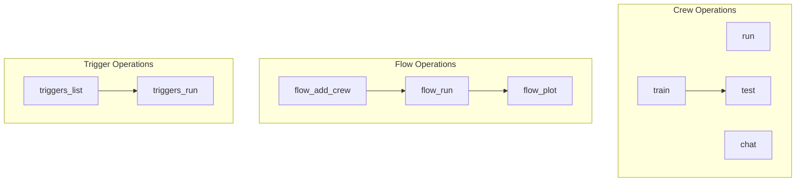

# execution_and_interaction
This module provides command-line interface functions for executing, interacting with, training, and managing AI crews and flows, including trigger handling and flow visualization.

<!-- DIAGRAM_JSON
{
    "nodes": [
        {
            "id": "run",
            "label": "run"
        },
        {
            "id": "chat",
            "label": "chat"
        },
        {
            "id": "train",
            "label": "train"
        },
        {
            "id": "test",
            "label": "test"
        },
        {
            "id": "flow_run",
            "label": "flow_run"
        },
        {
            "id": "flow_plot",
            "label": "flow_plot"
        },
        {
            "id": "triggers_list",
            "label": "triggers_list"
        },
        {
            "id": "triggers_run",
            "label": "triggers_run"
        },
        {
            "id": "flow_add_crew",
            "label": "flow_add_crew"
        }
    ],
    "edges": [
        {
            "source": "train",
            "target": "test"
        },
        {
            "source": "flow_add_crew",
            "target": "flow_run"
        },
        {
            "source": "flow_run",
            "target": "flow_plot"
        },
        {
            "source": "triggers_list",
            "target": "triggers_run"
        }
    ],
    "groups": [
        {
            "id": "crew_ops",
            "label": "Crew Operations",
            "nodes": [
                "run",
                "chat",
                "train",
                "test"
            ]
        },
        {
            "id": "flow_ops",
            "label": "Flow Operations",
            "nodes": [
                "flow_run",
                "flow_plot",
                "flow_add_crew"
            ]
        },
        {
            "id": "trigger_ops",
            "label": "Trigger Operations",
            "nodes": [
                "triggers_list",
                "triggers_run"
            ]
        }
    ]
}
-->
