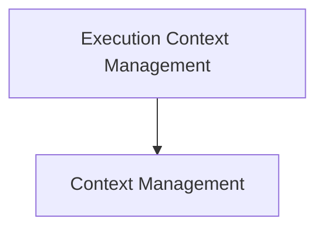

# Execution Context Management Module

## Introduction

The `execution_context_management` module is responsible for managing and propagating execution context within the CrewAI framework. It provides mechanisms to capture the current state of `ContextVars` (like task IDs, flow IDs, event IDs, etc.) into an `ExecutionContext` object and to restore that context at a later point. This ensures that relevant contextual information is maintained across asynchronous operations and different parts of the system.

## Architecture

The module primarily consists of a core sub-module focused on the direct management of this execution context.

<!-- DIAGRAM_JSON
{
    "direction": "TD",
    "nodes": [
        {"id": "execution_context_management", "label": "Execution Context Management", "type": "module"},
        {"id": "context_management", "label": "Context Management", "type": "module", "link": "context_management.md"}
    ],
    "edges": [
        {"source": "execution_context_management", "target": "context_management"}
    ],
    "groups": []
}
-->

## Sub-modules

### Context Management
This sub-module, documented in [context_management.md](context_management.md), provides the core functionality for handling the capture and application of execution context. It uses Python's `ContextVars` to store and retrieve crucial information related to the current execution flow, such as task IDs, flow IDs, and event sequences. This ensures that the context is correctly propagated and restored across different execution boundaries within the CrewAI system.