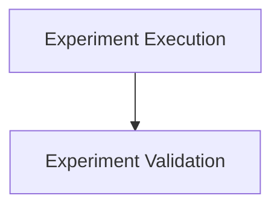

# Experiment Execution and Validation

## Introduction
This module is responsible for the systematic execution and rigorous validation of experiments within the CrewAI framework. It provides functionalities to run experiments with various configurations and to assert their outcomes against expected results or baselines, ensuring the reliability and quality of experimental evaluations.

## Architecture Overview
The `experiment_execution_and_validation` module is composed of two main sub-modules: `experiment_runner` and `experiment_validator`. The `experiment_runner` initiates and manages the experiment execution process, while the `experiment_validator` is responsible for evaluating the results and ensuring they meet predefined criteria or baselines.

## Sub-modules

*   [Experiment Execution](experiment_runner.md): This sub-module focuses on setting up and running experiments. It takes a dataset, optional crew and agents, and executes the experiment, returning the results for further analysis.
*   [Experiment Validation](experiment_validator.md): This sub-module provides utilities to validate the outcomes of an experiment. It checks for test failures and can compare current experiment results against a historical baseline to detect regressions.

<!-- DIAGRAM_JSON
{
    "direction": "TD",
    "nodes": [
        {"id": "experiment_runner", "label": "Experiment Execution", "type": "module", "link": "experiment_runner.md"},
        {"id": "experiment_validator", "label": "Experiment Validation", "type": "module", "link": "experiment_validator.md"}
    ],
    "edges": [
        {"source": "experiment_runner", "target": "experiment_validator"}
    ],
    "groups": []
}
-->

