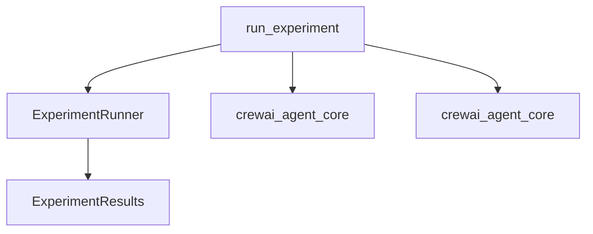

The `experiment_runner` module is a crucial part of the `crewai_experimental_evaluation` system, specifically designed to orchestrate the execution of experiments. It provides the core functionality to run defined experiments against a given dataset, utilizing agents and crews for evaluation.

### Purpose and Core Functionality

The primary purpose of the `experiment_runner` module is to execute experimental runs. Its main component, `run_experiment`, acts as an entry point for initiating evaluation processes. It takes a dataset, along with optional `Crew` and `Agent` configurations, to perform the experiment and return the results.

The module abstracts the underlying complexity of experiment execution, providing a clean interface for developers to conduct evaluations and gather insights into the performance of their AI agents and crews.

### Architecture and Component Relationships

The `experiment_runner` module, through its `run_experiment` function, orchestrates the experiment flow by delegating the actual execution to an `ExperimentRunner` instance. It depends on external modules for defining agents, crews, and the structure of the experiment results.

<!-- DIAGRAM_JSON
{
    "direction": "TD",
    "nodes": [
        {"id": "run_experiment", "label": "run_experiment", "type": "component", "link": null},
        {"id": "ExperimentRunner_class", "label": "ExperimentRunner", "type": "component", "link": null},
        {"id": "crew_module", "label": "crewai_agent_core", "type": "external", "link": "crewai_agent_core.md"},
        {"id": "agent_module", "label": "crewai_agent_core", "type": "external", "link": "crewai_agent_core.md"},
        {"id": "ExperimentResults_type", "label": "ExperimentResults", "type": "external", "link": "crewai_experimental_evaluation.md"}
    ],
    "edges": [
        {"source": "run_experiment", "target": "ExperimentRunner_class"},
        {"source": "run_experiment", "target": "crew_module"},
        {"source": "run_experiment", "target": "agent_module"},
        {"source": "ExperimentRunner_class", "target": "ExperimentResults_type"}
    ],
    "groups": []
}
-->

**Core Components:**

*   **`run_experiment`**: This is the primary function within the `experiment_runner` module. It initializes an `ExperimentRunner` instance and invokes its `run` method to start the experiment.
    *   **Input**: Takes a `dataset`, optional `Crew` and `Agent` instances, and a `verbose` flag.
    *   **Output**: Returns an `ExperimentResults` object.

**Internal Relationships:**

*   `run_experiment` instantiates and utilizes the `ExperimentRunner` class to manage the lifecycle and execution of the experiment. The `ExperimentRunner` class encapsulates the logic for iterating through the dataset and coordinating the evaluation process.

**External Dependencies:**

*   **`crewai_agent_core`**: The `run_experiment` function directly depends on `Crew` and `Agent` objects. These fundamental components are defined within the `crewai_agent_core` module, which handles the core definitions and functionalities of agents and crews in the CrewAI framework. For more details, refer to [crewai_agent_core.md](crewai_agent_core.md).
*   **`crewai_experimental_evaluation`**: The `ExperimentResults` type, which is the output of `run_experiment`, is assumed to be defined within the broader `crewai_experimental_evaluation` module. This module likely provides the data structures for storing and representing the outcomes of experimental evaluations. For further information, see [crewai_experimental_evaluation.md](crewai_experimental_evaluation.md).

### How the Module Fits into the Overall System

The `experiment_runner` module is a leaf module within the `crewai_experimental_evaluation` system. It sits under `experiment_testing` and `experiment_execution_and_validation`, serving as the concrete implementation for executing experimental workflows.

It receives experiment configurations and data, then uses core CrewAI components (`Agent` and `Crew`) to perform the actual runs. The results are then packaged into an `ExperimentResults` object, which can be further processed or analyzed by other parts of the `crewai_experimental_evaluation` framework, such as the `experiment_validator` or other reporting tools. This clear separation of concerns ensures that the core logic of experiment execution is robust and easily maintainable.
It's an integral part of the evaluation pipeline, enabling developers to systematically test and benchmark their AI solutions.