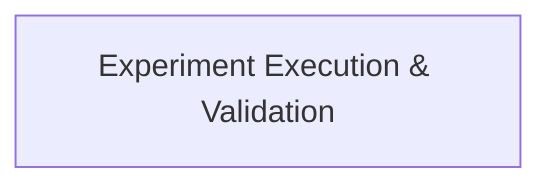

# Experiment Testing Module Documentation

## Introduction and Purpose

The `experiment_testing` module is a crucial component within the `crewai.experimental.evaluation` package, designed to facilitate the execution and validation of experiments. Its primary purpose is to provide utilities for running various experimental setups and asserting their outcomes against expected behaviors or predefined baselines. This module is essential for ensuring the reliability and performance of different configurations and features within the CrewAI framework through systematic testing.

## Architecture Overview

The `experiment_testing` module is straightforward, focusing on core experiment execution and validation logic. It integrates with other parts of the evaluation system and potentially with CrewAI's core components (Agents, Crews) for running experiments.

<!-- DIAGRAM_JSON
{
    "direction": "TD",
    "nodes": [
        {"id": "experiment_execution_and_validation", "label": "Experiment Execution & Validation", "type": "module", "link": "experiment_execution_and_validation.md"}
    ],
    "edges": [],
    "groups": []
}
-->

## Sub-modules

### Experiment Execution & Validation ([experiment_execution_and_validation.md](experiment_execution_and_validation.md))
This sub-module contains the core logic for running experiments and asserting their results. It provides functions to execute experiments with given datasets, agents, and crews, and to validate the outcomes, including comparing them against baseline results to detect regressions.

