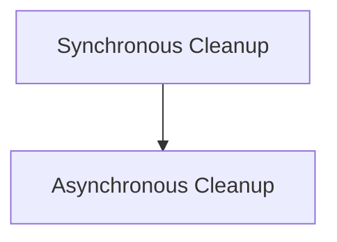

# Expired Cache Cleanup Module

The `expired_cache_cleanup` module is responsible for managing and purging expired files from the application's upload cache. It provides both synchronous and asynchronous mechanisms to ensure that temporary files are removed efficiently, optionally deleting them from the file providers as well. This module is a critical component of the `cache_cleanup` system, maintaining cache hygiene and preventing resource accumulation.

## Architecture Overview

The `expired_cache_cleanup` module is designed around two primary operational modes: synchronous and asynchronous cleanup. Both modes interact with the `UploadCache` to identify and remove expired entries. The asynchronous mode further optimizes cleanup by allowing concurrent deletion operations with file providers.

<!-- DIAGRAM_JSON
{
    "direction": "TD",
    "nodes": [
        {"id": "sync_cleanup_operations", "label": "Synchronous Cleanup", "type": "module", "link": "sync_cleanup_operations.md"},
        {"id": "async_cleanup_operations", "label": "Asynchronous Cleanup", "type": "module", "link": "async_cleanup_operations.md"}
    ],
    "edges": [
        {"source": "sync_cleanup_operations", "target": "async_cleanup_operations", "label": "Can be replaced by"}
    ],
    "groups": []
}
-->

## Sub-modules

### [Synchronous Cleanup Operations](sync_cleanup_operations.md)

This sub-module provides the core functionality for synchronously cleaning up expired files from the cache. It processes cached entries sequentially and can optionally trigger deletion from external file providers.

### [Asynchronous Cleanup Operations](async_cleanup_operations.md)

This sub-module offers an asynchronous approach to cleaning up expired files. It leverages concurrency to efficiently remove multiple expired files from both the cache and external providers, improving performance for large-scale cleanup tasks.
