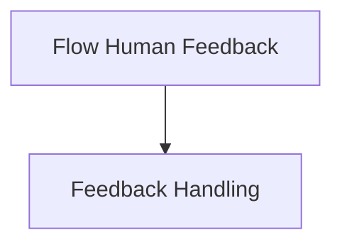

# Feedback Wrappers Module

## Introduction

The `feedback_wrappers` module is a crucial component within the `crewai_flow_management` system, specifically designed to integrate human feedback into the execution of flows. It provides a robust mechanism for both synchronous and asynchronous operations, allowing for pre-review processes, real-time human input, and the distillation of lessons learned from these interactions. This module enhances the adaptive capabilities of the system by enabling flows to learn and improve based on human guidance.

## Architecture Overview

The `feedback_wrappers` module is a sub-module of `flow_human_feedback`, which is part of the broader `crewai_flow_management` system. It primarily consists of wrappers that intercept method calls within a flow, introduce human feedback steps, and then process that feedback to influence subsequent executions or capture learnings.

<!-- DIAGRAM_JSON
{
    "direction": "TD",
    "nodes": [
        {"id": "flow_human_feedback", "label": "Flow Human Feedback", "type": "module", "link": "flow_human_feedback.md"},
        {"id": "feedback_handling", "label": "Feedback Handling", "type": "module", "link": "feedback_handling.md"}
    ],
    "edges": [
        {"source": "flow_human_feedback", "target": "feedback_handling"}
    ],
    "groups": []
}
-->

## Sub-modules

*   **[Feedback Handling](feedback_handling.md)**: This sub-module contains the core logic for handling human feedback within flow execution. It provides both asynchronous and synchronous wrappers that incorporate pre-review mechanisms, request human feedback, process it, and distill lessons for continuous improvement.
