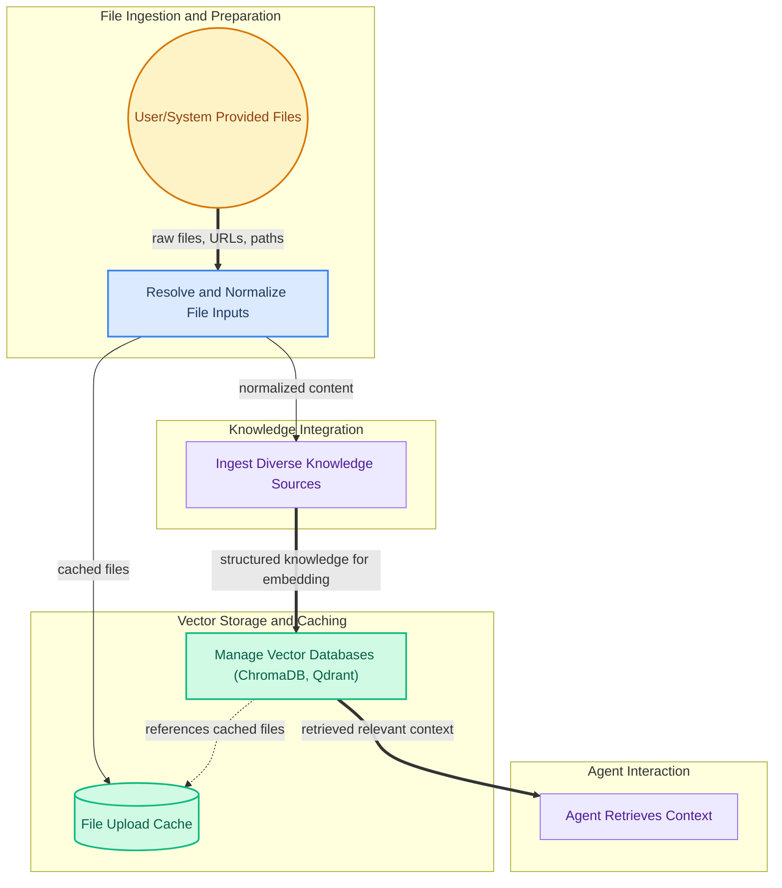

The `file_and_rag_infra` module provides the foundational infrastructure for managing files, including caching and resolution, and integrates Retrieval Augmented Generation (RAG) capabilities with various knowledge sources and vector stores. It enables agents to seamlessly ingest diverse data formats, process them for retrieval, and store them efficiently for contextual understanding and response generation.

### How it Works

The module orchestrates the flow from raw file inputs to structured, retrievable knowledge for AI agents. It begins by resolving and normalizing various file inputs (local paths, URLs, bytes) and managing their caching. These processed files are then ingested from diverse knowledge sources (documents, spreadsheets) and transformed into a format suitable for vector databases. Finally, it manages these vector stores, allowing agents to retrieve relevant context efficiently.

### Core Components Documentation

*   **File Caching**: Manages the storage and cleanup of uploaded and processed files.
    *   [file_caching.md](file_caching.md)
*   **File Resolution**: Handles the standardization and resolution of various file inputs into a consistent format.
    *   [file_resolution.md](file_resolution.md)
*   **RAG Vector Stores**: Provides the core components for interacting with vector databases like ChromaDB and Qdrant for Retrieval Augmented Generation.
    *   [rag_vector_stores.md](rag_vector_stores.md)
*   **Knowledge Sources**: Offers a unified interface for integrating diverse knowledge sources, such as documents and spreadsheets.
    *   [knowledge_sources.md](knowledge_sources.md)