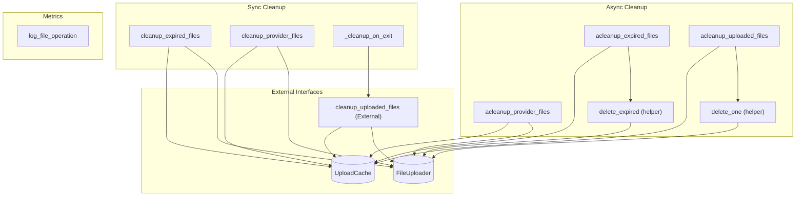

# file_caching Module
The `file_caching` module provides synchronous and asynchronous functions for managing and cleaning up cached files, including operations for expired entries, specific providers, and general uploaded files, alongside a utility for logging file operations.

<!-- DIAGRAM_JSON
{
    "nodes": [
        {
            "id": "file_caching",
            "label": "file_caching",
            "type": "module"
        },
        {
            "id": "CleanupExpired",
            "label": "cleanup_expired_files"
        },
        {
            "id": "CleanupProvider",
            "label": "cleanup_provider_files"
        },
        {
            "id": "DeleteExpiredHelper",
            "label": "delete_expired (helper)"
        },
        {
            "id": "ACleanupProvider",
            "label": "acleanup_provider_files"
        },
        {
            "id": "ACleanupUploaded",
            "label": "acleanup_uploaded_files"
        },
        {
            "id": "DeleteOneHelper",
            "label": "delete_one (helper)"
        },
        {
            "id": "ACleanupExpired",
            "label": "acleanup_expired_files"
        },
        {
            "id": "LogFileOp",
            "label": "log_file_operation"
        },
        {
            "id": "CleanupOnExit",
            "label": "_cleanup_on_exit"
        },
        {
            "id": "UploadCache",
            "label": "UploadCache (Interface)",
            "type": "interface"
        },
        {
            "id": "FileUploader",
            "label": "FileUploader (Interface)",
            "type": "interface"
        },
        {
            "id": "SyncCleanupUploaded",
            "label": "cleanup_uploaded_files (External)",
            "type": "external"
        },
        {
            "id": "file_metrics",
            "label": "File Metrics",
            "type": "module",
            "link": "file_metrics.md"
        },
        {
            "id": "cache_management",
            "label": "Cache Management",
            "type": "module",
            "link": "cache_management.md"
        }
    ],
    "edges": [
        {
            "source": "CleanupExpired",
            "target": "UploadCache"
        },
        {
            "source": "CleanupExpired",
            "target": "FileUploader"
        },
        {
            "source": "CleanupProvider",
            "target": "UploadCache"
        },
        {
            "source": "CleanupProvider",
            "target": "FileUploader"
        },
        {
            "source": "DeleteExpiredHelper",
            "target": "FileUploader"
        },
        {
            "source": "ACleanupExpired",
            "target": "UploadCache"
        },
        {
            "source": "ACleanupExpired",
            "target": "DeleteExpiredHelper"
        },
        {
            "source": "ACleanupProvider",
            "target": "UploadCache"
        },
        {
            "source": "ACleanupProvider",
            "target": "FileUploader"
        },
        {
            "source": "DeleteOneHelper",
            "target": "FileUploader"
        },
        {
            "source": "ACleanupUploaded",
            "target": "UploadCache"
        },
        {
            "source": "ACleanupUploaded",
            "target": "DeleteOneHelper"
        },
        {
            "source": "CleanupOnExit",
            "target": "SyncCleanupUploaded"
        },
        {
            "source": "SyncCleanupUploaded",
            "target": "UploadCache"
        },
        {
            "source": "SyncCleanupUploaded",
            "target": "FileUploader"
        },
        {
            "source": "file_caching",
            "target": "file_metrics"
        },
        {
            "source": "file_caching",
            "target": "cache_management"
        }
    ],
    "groups": [
        {
            "id": "sync_cleanup",
            "label": "Sync Cleanup",
            "nodes": [
                "CleanupExpired",
                "CleanupProvider",
                "CleanupOnExit"
            ]
        },
        {
            "id": "async_cleanup",
            "label": "Async Cleanup",
            "nodes": [
                "ACleanupExpired",
                "ACleanupProvider",
                "ACleanupUploaded",
                "DeleteExpiredHelper",
                "DeleteOneHelper"
            ]
        },
        {
            "id": "metrics",
            "label": "Metrics",
            "nodes": [
                "LogFileOp"
            ]
        },
        {
            "id": "external",
            "label": "External Interfaces",
            "nodes": [
                "UploadCache",
                "FileUploader",
                "SyncCleanupUploaded"
            ]
        }
    ]
}
-->
